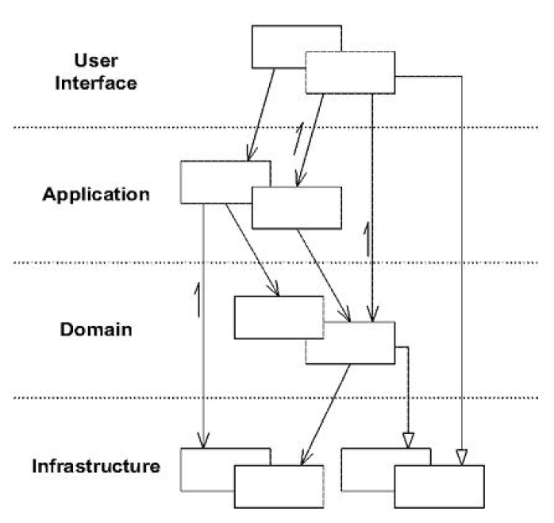
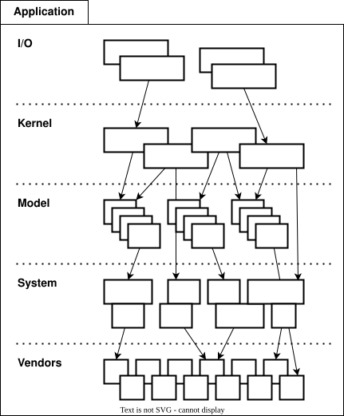
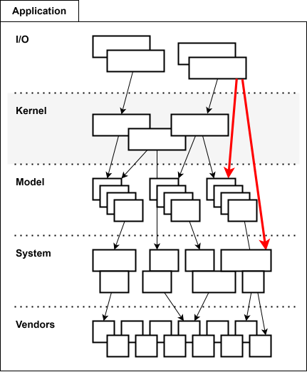

= Horizontal layers

Applications SHOULD adopt a layered architecture. A layered architecture
involves organizing code into conceptual layers that each represent distinct
concerns.

An excellent model for separating concerns into layers is provided by Eric Evans
in his "blue book" on
https://www.domainlanguage.com/ddd/blue-book/[domain-driven design]. The
following image is taken from that book.

Evans proposed four conceptual layers in an application's architecture:

* The *user interface* or *presentation* layer is responsible for showing
  information to the user and interpreting the user's commands. (The "user" may
  be any external actor, whether a person or another computer process.)

* The *application* layer coordinates the application's jobs. This is a thin
  layer that does not contain any business rules, but which exists to coordinate
  tasks requested by users via the UI layer above, delegating much of the work
  to services or objects in the domain layer below. The application layer may
  manage state related to the progress of operations ("ui state"), but should
  not manage state related to domain objects ("application state").

* The *domain* or *model* layer is where the business domain or problem space is
  modeled as a series of interconnected objects, using object-oriented
  programming constructs. The domain layer captures business rules and logic,
  and manages the state of business entities (though the technical details of
  persisting domain state is delegated to the infrastructure layer).

* The *infrastructure* layer provides general technical capabilities that
  support the higher layers. For example, abstractions of the database access
  layer, file system access, and network communication protocol should be
  implemented in the infrastructure layer. Interfaces for messaging services,
  logging tools and monitoring services, and other external systems, are other
  candidates for inclusion in an application's infrastructure layer.

// TODO: Add sidebar that defines "ui state" versus "application/business
state".

A key constraint of domain-oriented architecture is that software components
within each conceptual layer depend only on components in the layers below it.
The objective of this constraint is to isolate the domain model from the rest of
the application code.

[quote, Eric Evans, Domain-Driven Design: Tackling Complexity in the Heart of Software (2003)]
____
Separating the domain layer from the infrastructure and user interface [...]
allows a much cleaner design of each layer. Isolated layers are much less
expensive to maintain, because they tend to evolve at different rates and
respond to different needs.
____

The following is an iteration on the domain-based layered architecture. It uses
the same four conceptual layers, but with different names and one additional
layer. This naming convention is RECOMMENDED by this technical standard:

* *I/O*: Conceptually equivalent to the UI layer in domain-based architecture,
  the I/O layer is responsible for capturing input from users (or other clients)
  and returning responses. This layer parses incoming messages, validates input
  data, and maps user requests to commands, event handlers, or services in the
  application's kernel, below it. The I/O layer may handle communication with
  the outside world via multiple different protocols and technologies. For
  example, an API application may support I/O via a combination of HTTP,
  WebSockets, gRPC, and message queues. An application may also support a
  command line interface (CLI) alongside a graphical user interface (GUI), for
  example.

* *Kernel*: The kernel is the core of the application. All input to, and all
  output from, the application should pass through this layer. The application
  kernel controls everything that happens in the application, just as an
  operating system kernel controls everything that happens in an operating
  system. Conceptually, the kernel is equivalent to the application layer in
  domain-driven design. The kernel should be relatively thin, acting mostly as a
  mediator between the I/O handlers (in the layer above) and the domain services
  and objects (in the model layer below). The application kernel should not hold
  state related to the domain model, but it may hold UI state that reflects the
  progress of tasks being undertaken for users.

* *Model*: This layer encapsulates a model of the application's business domain
  or problem space. (Models, in this context, are not _data models_, such as
  those generated by ORM tools; they are _domain models_, which are a
  representation of the business domain and its rules.) The domain model is
  coded using object-oriented constructs, which encapsulate business rules and
  represent entities, events, and other concepts from the real world. This layer
  is also responsible for managing business state (though responsibility for
  persisting this state is delegated to external systems such as databases).

* *System*: The system layer is analogous to the infrastructure layer in
  domain-driven design. It provides abstractions to the runtime platform of the
  application, and to components in the wider system in which the application
  operates – things like databases, message queues, other services running on
  the same local network, as well as external services running on remote
  systems.

* *Vendors*: This is an optional layer, which is not present in the horizontal
  layers of domain-driven design. This layer provides facades to third-party
  libraries that are installed locally in development environments and bundled
  with the production instances of the application. (Such dependencies are
  commonly managed using a package management system, but this is not a
  requirement.) It may also provide facades to third-party APIs and other
  external services. This allows application code, in the layers above, to
  import the facades rather than the underlying dependencies, making it easier
  to replace vendor (third-party) components with alternative implementations or
  alternative services.

Conceptually, the first four layers map directly to the four layers of
domain-driven design architecture:

* UI, presentation → I/O
* application → kernel
* domain, model → model
* infrastructure → system

The fifth layer – called "vendors" – is a pragmatic addition that recognizes the
reality that modern software applications tend to have a very high dependence on
application frameworks, third-party libraries, and remote web services. The
inclusion of this layer is intended to encourage application developers to
reduce coupling on vendor-specific libraries and third-party APIs by abstracting
them behind facades. The interfaces of those facades are defined by the
application and captured in the vendors layer.

As in domain-driven design, components within each layer SHOULD depend only on
components in the layers below them:

In domain-driven design, layers may be "skipped" in communication between
components. This technical standard adds an extra constraint on the design of
application kernel layer:
_all input to, and all output from, an application should pass through its kernel_.
Thus, all communication between the I/O layer and the deeper layers of the
system MUST pass through the kernel.

This constraint is intended to make the application kernel the central point of
control for the whole application. It enforces the requirement that the kernel
layer singularly defines everything that the application does.

One of the advantages of this design is that the layers are stacked in
alphabetical order. If the layers are represented as directories in the
codebase, they will be listed in alphabetical order in most filesystems by
default, and so the visual representation of the layers in the code will match
their conceptual positioning in the architecture.

----
.
├── IO
│   └── ...
├── Kernel
│   └── ...
├── Model
│   └── ...
├── System
│   └── ...
└── Vendors
    └── ...
----
