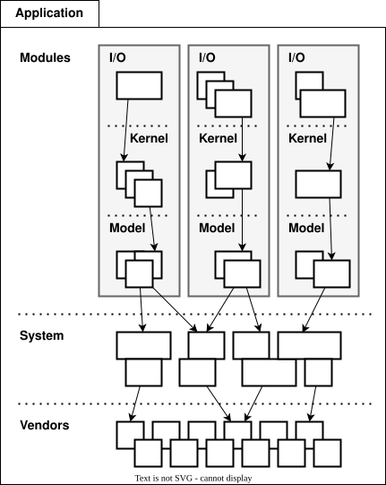

= Vertical slices

An extension of this layered architecture adds vertical slices through the top
three layers, organizing the main application-specific code into modules. For
example, an application may be composed of three modules: users, products, and
orders. Each module has its own I/O and application kernel, and also its own
model that represents a subdomain of the overall domain.

Critically, the modules SHOULD NOT be allowed to call each other directly.
Instead, modules should communicate indirectly (and ideally asynchronously,
using messages or events) via a channel provided by the system layer.

This design constraint reduces coupling between modules, making it easier to
maintain and scale an application. For example, it becomes possible to
incrementally extract modules into separate services, so decomposing a system
from a modular monolith to a distributed service-oriented design.

The filesystem for a modular monolith's source code might look like the below
scheme. The filesystem reflects the conceptual architecture, with each module
encapsulated in its own directory, and the horizontal layers of the architecture
represented as subdirectories within each module. The global layers – system and
vendors – are represented as top-level directories, extracted from the modules.

----
.
├── Modules
│   ├── <ModuleA>
│   │     ├── IO
│   │     │   └── ...
│   │     ├── Kernel
│   │     │   └── ...
│   │     └── Model
│   │         └── ...
│   ├── <ModuleB>
│   │     ├── ...
│   │     └── ...
├── System
│   └── ...
└── Vendors
    └── ...
----
