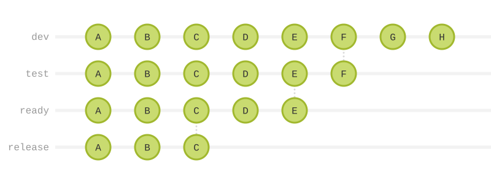
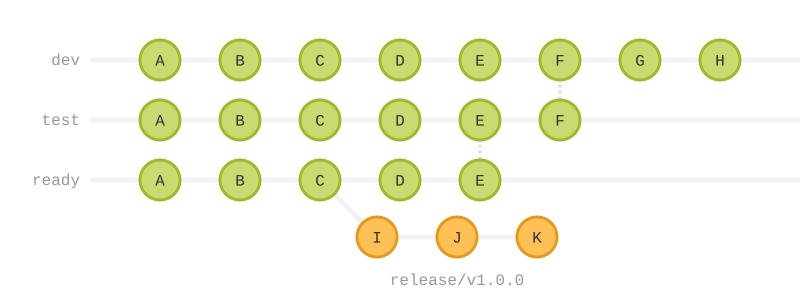

= Releases

The release process — promoting stable code to production and delivering it to users — varies significantly depending on the context in which software is made and delivered. This standard accommodates that flexibility by decoupling the _development_ process from the _release_ process.

This standard REQUIRES continuous delivery, which means that every change is automatically built, tested, and prepared for release as part of the normal development workflow. However, continuous delivery does not mandate continuous _deployment_. You may choose to release small increments frequently, or to bundle multiple changes into infrequent release trains. The choice of release cadence is flexible, but the ability to release at any time is a core objective.

Every commit on `ready` is a candidate for release, but deployment is not mandatory — you choose the release strategy and cadence.

The choice of release *cadence* (big bang, release trains, or continuous deployment) and *rollout strategy* (rolling, canary, blue/green, feature flags) is covered in detail in *link:../010/README.adoc[TS-10: Releasing]*. This section of TS-9 focuses on the version-control mechanics that support those choices.

== Release workflows

To support all release cadences, this technical standard RECOMMENDS two different processes for managing releases via version control systems:

* A *release trunk* workflow supports continuous deployment.
* A *release branch* workflow supports release trains and big bangs.

In both workflows, releases are cut from stable revisions on the `ready` trunk line. What differs is _how_ and _when_ those releases are made.

=== Release trunks

****
* Naming convention: `release`
* Lifespan: Permanent
* Protected: Yes
* Mutable: No
* Stable: Yes
* Requirement level: OPTIONAL
****

A perpetual `release` trunk supports continuous deployment. Every change that passes automated verification on `ready` is automatically built, tested, and promoted to the `release` trunk for immediate deployment to production.

The `release` trunk has the same chronology of commits as the other trunk lines, but is usually some steps behind the tip of the `ready` trunk.

The `release` trunk references compiled artifacts stored in an external artifact repository (registry, object storage, etc.), indexed by commit SHA or tag. The key constraint: you must be able to deploy the latest revision _immediately_, without waiting for builds to complete or tests to rerun. This enables rapid incident response — for example, rolling back to a previous revision in production by redeploying an older build from the artifact repository.

=== Release branches

****
* Naming convention: `release/<version>`
* Lifespan: Temporary
* Protected: Yes
* Mutable: No
* Stable: Yes
* Requirement level: OPTIONAL
****

An alternative strategy is to cut temporary release branches, one per release, from various points along the `ready` trunk. The release branches are versioned – `release/<version>`. If the version number is not yet decided at the time the branch is cut (for example, when QA findings may reclassify the release as major rather than minor), a placeholder name such as `release/next` MAY be used; the eventual tag carries the final version.

Release branches support release trains, big bang releases, and other discrete versioned releases. A release branch is created for each discrete release, eg. `release/1.2.0`, `release/2.0.0`. It is where that version is tagged, its changelog is defined, and any version-specific fixes are made.

A key benefit of cutting release branches from `ready` is that release preparation does NOT block ongoing development. While the release branch is being stabilised and tagged, `dev` continues to receive commits for the release after that. *Release-time code freezes are not needed* — the trunk-based model decouples release preparation from continued development. (Operational freezes for other reasons, such as high-traffic commercial events or holiday windows, are still appropriate; see *link:../010/README.adoc[TS-10: Releasing]*.)

Each release branch captures release metadata — including release notes, version tags, changelogs, and configuration (like secrets or feature flag states) — specific to that version. These do not need to merge back to the trunk lines. Ideally, the build system auto-generates this metadata in delivery pipelines, using source metadata from the `ready` branch (commit messages, git logs, source annotations).

The release branch itself is temporary. It is created to prepare a release and is deleted after the version is tagged and released. However, the release tags are permanent — they remain in the repository to reference the source code at the point of each release. Compiled artifacts (binaries, packages, container images) are stored in external artifact repositories, indexed by version tag.

The release branch workflow follows these steps:

1. Create a release branch from the current tip of the `ready` trunk. Name it with the version number: `git checkout -b release/<version> ready`
2. Prepare release metadata on the release branch: update version numbers, generate or finalize release notes and changelogs, and configure any release-specific settings (feature flags, secrets, etc.).
3. Verify the release through final validation: run the full test suite, build the release artifacts, and perform any final checks required before deployment.
4. Once verified, tag the release with the version: `git tag -a v<version>` (or however your versioning scheme dictates).
5. Build and store compiled artifacts in an external artifact repository (container registry, package repository, object storage, etc.), indexed by the version tag.
6. Delete the release branch: `git branch -D release/<version>` and `git push origin --delete release/<version>`. The version tag remains permanently in the repository.
7. Development continues on the `ready` trunk for the next release. If there are additional fixes needed for the current version, they flow back through `dev` and are promoted to `ready` like any other changes.

If release preparation fails — for example, tests fail, an artifact build is broken, or the wrong version number is committed — abandon the release branch and start over. Code or configuration fixes MUST NOT be committed to release branches; release branches MUST contain only release-preparation commits (version bumps, changelog updates, release-specific configuration). Fixes flow through `dev` and `ready` like any other change, and once the underlying issue is resolved on the trunk, a fresh release branch is cut. This preserves the fix-forward discipline established for the trunk lines and keeps release branches focused on a single responsibility.

== Artifact repositories

This standard distinguishes between two kinds of release artifacts:

* *Compiled artifacts* — Binaries, packages, container images, and other build outputs. These MUST NOT be stored in version control.

* *Release metadata* — Version tags, changelogs, release notes, configuration (secrets, feature flags). This can be stored in version control via release branches.

Git is optimized for source code, not binaries. Storing compiled artifacts in Git repositories significantly slows clone operations, bloats the repository size, and complicates merges. For this reason, compiled artifacts MUST NOT be stored in version control.

Anti-patterns to avoid:

* *Git Large File System (LFS)* — While useful for source-controlled media (images, videos), it is not suitable for release artifacts. It still ties artifacts to the repository, slowing operations and complicating distribution.

* *Orphaned branches* — Using dedicated branches to store only build artifacts pollutes the repository history and does not solve the fundamental problems above.

Instead, store built artifacts in dedicated systems external to version control, eg.:

* **Registries** — eg. Docker Hub, Amazon ECR, Maven Central, npm, PyPI, etc. — for containerized apps and libraries.

* **Object storage** — eg. Amazon S3, Google Cloud Storage, Azure Blob — for binaries, archives, and generic build outputs.

* **Generic artifact repositories** — eg. JFrog Artifactory, AWS CodeArtifact, Sonatype Nexus — for any artifact type.

Best practice is to create a two-way binding between version control and external artifact repositories using version numbering. For example, if `v1.2.3` is a tag in the repository, `v1.2.3` in the artifact repository refers to the compiled artifact built from the source code at the `v1.2.3` tag. This enables traceability and reproducible deployments.
