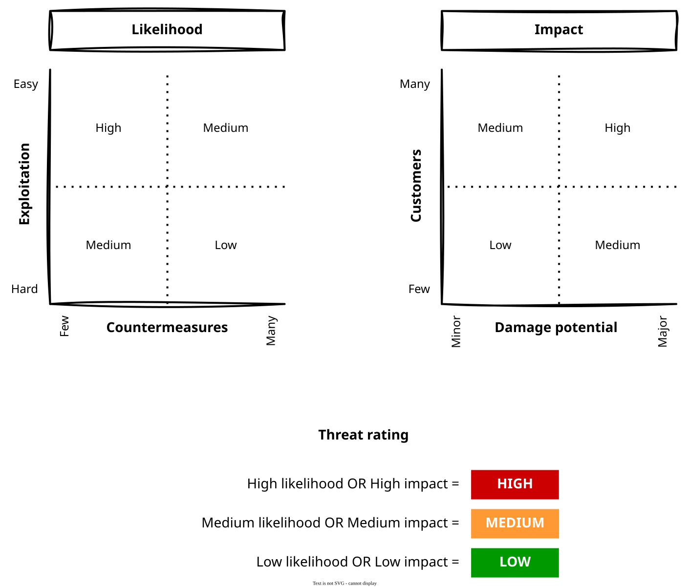

= Risk ratings

After identifying potential threats, the next step is to rate them based on
their likelihood of occurrence and scale of impact.

Each identified threat SHOULD be rated based on its likelihood of occurrence and
scale of impact. Combining the likelihood and impact scores gives an overall
severity level, typically rated from high to low.

The following diagram shows a common risk rating scheme. You may design your own
scoring system. The important thing is to be consistent in how you rank
potential threats.

