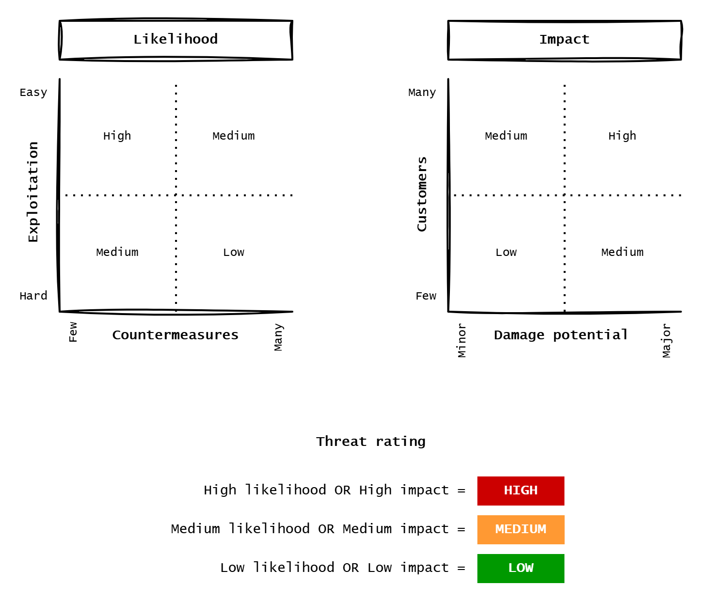

= TS-54: Threat modeling
:toc: macro
:toc-title: Contents

This technical standard covers the art and science of threat modeling. It provides guidance on how to identify potential security and privacy vulnerabilities in software systems, and how to decide on mitigation strategies, in a structured and systematic way.

toc::[]

== What is threat modeling?

Threat modeling is the process of analyzing representations of a system with the purpose of identifying potential security and privacy vulnerabilities, and deciding on mitigation strategies.

Threat modeling is more of a process than a tool or an artifact. There are various tools and frameworks that can be used to facilitate the process, but the core of threat modeling is the systematic analysis of a system's design to identify potential attack vectors and vulnerabilities.

The output of threat modeling workshops is a set of identified threats, with associated risk ratings and mitigation strategies. These are typically captured initially in a threat assessment table, and ultimately maintained in the application's risk register.

== General best practices

Threat modeling works best when it is iterative, baked into the regular development process, rather than a one-time activity.

Threat modeling workshops SHOULD begin during the design phase of a new software product. Thereafter, the threat assessments SHOULD be treated as living documents that are regularly revised as the system evolves, new threats emerge, or business requirements change.

Threat modeling workshops SHOULD NOT be postponed until the product/system is nearly ready to ship to production. With iterative threat assessment you will catch potential vulnerabilities earlier in the development cycle, when they will be cheaper to remediate. Because security and privacy requirements are cross-cutting architectural concerns, they tend to be expensive to retrofit into an established architecture.

It is RECOMMENDED to schedule threat modeling workshops at the break point between each iterative development/release cycle. Threat modeling workshops should be organized and facilitated by a security champion within each team.

Effective threat modeling benefits from a multi-disciplinary approach. Participants in threat modeling workshops should be drawn from architecture and security, product and business, and development, testing, and operations. The purpose is to view the system from diverse perspectives.

Various types of models SHOULD be used as input to threat modeling workshops. Different representations of a system will reveal different categories of potential attack vectors. RECOMMENDED models include:

* Infrastructure.
* Data (in situ and in transit).
* Services and components.
* Component boundaries and interfaces.
* Business processes (or application logic).
* External dependencies.

See also the https://www.threatmodelingmanifesto.org/[Threat Modeling Manifesto] for more information about the principles of threat modeling.

== Threat modeling frameworks

There are a number of standardized frameworks that can be used to guide the threat modeling process. These frameworks provide structured approaches to identifying potential threats and vulnerabilities.

The following standardized threat modeling frameworks may be helpful, depending on the type of system being modeled. You may choose to use a combination of these frameworks, or a custom framework tailored to your own needs.

=== STRIDE

The core activity of a threat modeling workshop is the systematic assessment of individual components and data flows within a system against various categories of potential threats. One of the most useful frameworks for this part of the process is STRIDE, a mnemonic-based framework developed by Microsoft that categorizes threats into six groups:

|===
|Threat category |Definition |Example |Examples of countermeasures

|*Spoofing*
|Impersonation of another user or system (https://en.wikipedia.org/wiki/Spoofing_attack[Wikipedia])
|Faking an email address to manipulate the recipient into sharing confidential information
|Sender Policy Framework (SPF) and/or DomainKeys Identified Mail (DKIM) to verify the sender

|*Tampering*
|Unauthorized modification of data (https://en.wikipedia.org/wiki/Tampering_%28crime%29[Wikipedia])
|Modifying data on a website to redirect visitors to a phishing page
|Hashes and digital signatures for data validation and tamper detection

|*Repudiation*
|Measures that attackers take to leave no trace of their malicious actions (https://en.wikipedia.org/wiki/Non-repudiation[Wikipedia])
|Altering log files to hide unauthorized access
|Audit and logging mechanisms to track all system activity, and automated log analysis to reveal suspicious events

|*Information disclosure*
|Leaking of sensitive data to unauthorized parties (https://en.wikipedia.org/wiki/Data_breach[Wikipedia])
|Hacking into a database to steal credit card information
|Encryption of sensitive data, and access control mechanisms

|*Denial of service (DoS)*
|Rendering a system unusable (https://en.wikipedia.org/wiki/Denial-of-service_attack[Wikipedia])
|Flooding a website with excessive requests to crash the server
|Rate limiting to prevent DoS, and load balancing to distribute traffic across multiple servers

|*Elevation of privilege*
|Gaining higher access levels than authorized (https://en.wikipedia.org/wiki/Privilege_escalation[Wikipedia])
|Exploiting a vulnerability to elevate user permissions, allowing access to confidential data or systems
|Implementing the principle of least privilege with role-based access controls
|===

=== PASTA

PASTA – Process for Attack Simulation and Threat Analysis – is a multi-stage methodology that aligns business objectives with technical requirements. The stages progress through:

1. Defining the business objectives.
2. Defining the technical scope.
3. Decomposing the application into its component parts.
4. Identifying potential vulnerabilities.
5. Enumerating the likelihood and impact of attacks.

To identify potential vulnerabilities, analysts use either the STRIDE framework or a vulnerability database (see below).

The end result is a comprehensive risk and impact assessment. PASTA can be a very time-consuming process so it does not lend itself to fast iterative development processes. It is most suited to long-lived critical systems.

=== VAST

VAST – Visual, Agile, and Simple Threat modeling – is designed to scale threat modeling across entire organizations and to work well with iterative development workflows. VAST's scalability makes it a good fit for organizations with multiple teams and products, and short release cycles.

VAST covers two types of threat modeling:

* Application threat modeling for development teams, focusing on process flow diagrams.
* Operational threat modeling for infrastructure teams, focusing on attack trees.

=== LINDDUN

LINDDUN is a privacy-focused threat modeling framework. It serves as a privacy-oriented counterpart to STRIDE. LINDDUN helps identify privacy threats by systematically examining how personal data flows through a system and where privacy violations may occur. The name is an acronym for the following threat classifications:

* *Linkability*: An attacker can link two or more items of data without knowing the actual identity behind them.
* *Identifiability*: An attacker can identify a specific user or system entity.
* *Non-repudiation*: A user cannot deny having performed a malicious action.
* *Detectability*: An attacker can determine whether an item of interest (eg a user or transaction) exists in the system.
* *Disclosure of information*: When sensitive data is exposed to unauthorized parties.
* *Unawareness*: When users are unaware that their data is being collected, processed, or shared, and therefore cannot exercise meaningful control over it.
* *Non-compliance*: When a system or its operators fail to comply with privacy-related regulations, standards, or user agreements.

LINDDUN is recommended for systems handling personal information, particularly those subject to regulations like GDPR or CCPA.

=== Attack trees

Attack trees are hierarchical diagrams representing how attackers might compromise a system to achieve a specific goal. The tree's root represents the attacker's ultimate objective, with branches showing different paths or sub-goals needed to achieve it. Leaf nodes represent specific actions or vulnerabilities the attacker could exploit. Attack trees can be enriched with attributes like cost, likelihood, or required skill level.

Attack trees are useful models for visualizing complex attack scenarios, where multiple steps are required to compromise a system.

=== Kill chains

A kill chain (or cyber kill chain) is a framework originally developed by Lockheed Martin that models the stages of a cyber attack. The traditional seven stages are:

1. *Reconnaissance*: Research and target identification.
2. *Weaponization*: Creating a malicious payload.
3. *Delivery*: Transmitting the weapon to the target.
4. *Exploit*: Triggering the exploit.
5. *Installation*: Installing malware.
6. *Command and control*: Establishing remote access.
7. *Actions on objectives*: Achieving the attacker's goal.

Understanding these stages helps defenders implement layered defenses. The framework is particularly valuable for understanding advanced threats.

== Threat modeling workshops

Threat modeling workshops SHOULD be conducted at regular intervals. It is RECOMMENDED to schedule threat modeling workshops at the break point between each iterative development or release cycle. Betters still, workshops should be integrated into the normal development life cycle of individual features.

Threat modeling workshops SHOULD be organized and facilitated by a security champion within each team. The rest of the participants play the role of security analysts.

Effective threat modeling benefits from a multi-disciplinary approach. Therefore, threat modeling workshops are the most effective when participants are drawn from architecture and security, product and business, and development, testing, and operations. The purpose is to view the system from diverse perspectives.

Threat modeling workshops SHOULD follow a structured approach. The following steps are RECOMMENDED:

1. Review business objectives and scope.
2. Review component architecture, data flows, system interfaces, etc.
3. Systematically assess threats against individual components.
4. Rank risks based on assessment of likelihood and impact.
5. Identify and prioritize mitigation strategies.

The outcome of a threat modeling workshop is a list of identified threats, risk ratings, and agreed mitigation strategies (if any). The outcomes of a threat modeling workshop SHOULD be captured in a formal report, with the identified threats and their mitigation strategies summarized in a threat assessment table.

The following serves as a useful starter template for reporting the outcomes of a threat modeling workshop. It incorporates patterns from threat modeling frameworks such as STRIDE and PASTA. See also link:./threat-modeling-workshop.example.adoc[this concrete example of a threat modeling workshop report], which is based on the same template.

[source,markdown]
----
# Threat modeling workshop <YYYY-MM-DD>

- **System/application name**: _____
- **Session facilitator**: _____
- **Participants**:
  - **Business stakeholder**: _____
  - **Technical architect**: _____
  - **Development lead**: _____
  - **Security analyst**: _____
  - **Privacy officer** (eg. data controller): _____
  - **Other stakeholders**: _____

Pre-session checklist:

- [ ] Schedule participants.
- [ ] Gather architecture diagrams and documentation.
- [ ] Review previous threat models (if updating).
- [ ] Prepare collaboration tools (whiteboard, diagramming software).

Session checklist:

- [ ] Review business objectives and scope.
- [ ] Review component architecture, data flows, system interfaces, etc.
- [ ] Assess STRIDE threat categories against individual components.
- [ ] Rank risks based on assessment of likelihood and impact.
- [ ] Identify and prioritize mitigation strategies.

Post-session checklist:

- [ ] Distribute completed threat assessment to stakeholders.
- [ ] Create tickets for mitigation work.
- [ ] Schedule next treat modeling workshop
- [ ] Transfer newly identified threats to the risk register.

## 1. Business context

What are the business objectives? Why does the system exist? What business
value does it provide? What are the critical business functions?

Who are the key stakeholders?

What is the business impact of security/privacy failures – eg. financial,
reputational, regulatory, operational, etc.?

## 2. Technical scope

Define what is being threat modeled. What the system boundaries, or the
in-scope components?

What is the technology stack? What are the deployment environments? What are
the integration points or interfaces with other (out-of-scope) systems?

## 3. Decomposition

How does the system work?

Include or link to architectural diagrams and other useful design documents
and models.

Use the models to identify key components, data flows, entry points, trust
boundaries, and the most sensitive assets.

### Key components

Identify the key components of the system, along with their trust levels
and the categories of data they handle. Internal components tend to be
trusted while external ones are not; components at the interface between
internal and external components, such as API gateways, are semi-trusted.

|Component |Description |Trust level |Data handled |
|----------|------------|------------|-------------|
|...       |...         |...         |...          |
|...       |...         |...         |...          |
|...       |...         |...         |...          |

### Data flows

Identify the data flows between the key components. Include details of
data types, transport protocols (and whether they are encrypted), and any
authentication or signing systems in place.

|Source |Destination |Data type |Protocol |Authentication |
|-------|------------|---------|---------|----------------|
|...    |...         |...      |...      |...             |
|...    |...         |...      |...      |...             |
|...    |...         |...      |...      |...             |

### Sensitive assets

Identify the assets that must be protected from unauthorized access,
eg. data, keys, certificates, and other secrets.

|Asset |Sensitivity |Integrity requirements |Availability requirements |Privacy concern |
|------|------------|-----------------------|--------------------------|----------------|
|...   |...         |...                    |...                       |...             |
|...   |...         |...                    |...                       |...             |
|...   |...         |...                    |...                       |...             |

### Entry points

Identify the external interfaces, APIs, and user interfaces to the system.

### Trust boundaries

Identify where trust changes, eg. internet to DMZ, DMZ to internal network.

## Threat assessment

Finally, consider the potential threats against the identified components,
data flows, and assets. Use the STRIDE framework to rank each threat
against each component/flow and rank the resulting risks.

|Ref |Component/Flow |Description |Type |Countermeasures |Likelihood |Impact |Rating |
|----|---------------|------------|-----|----------------|-----------|-------|-------|
|TA1 |...            |..          |...  |...             |...        |...    |...    |
|TA2 |...            |..          |...  |...             |...        |...    |...    |
|TA3 |...            |..          |...  |...             |...        |...    |...    |
|TA4 |...            |..          |...  |...             |...        |...    |...    |
|TA5 |...            |..          |...  |...             |...        |...    |...    |

(Add links to issue trackers, resolution deadlines, etc. as required.)
----

For the threat assessment, an alternative structure is to analyze each
component's vulnerability a list of threat types – eg. the STRIDE categories,
or the OWASP Top 10 – to determine if a sensitive asset can be compromised
by each particular attack vector.

[source,markdown]
----
## Component/Flow: _____

|Threat type |Threat description |Asset at risk | Countermeasures |Likelihood |Impact |Rating |
|------------|-------------------|--------------|-----------------|-----------|-------|-------|
|Spoofing    |...                |...           |...              |...        |...    |...    |
|Tampering   |...                |...           |...              |...        |...    |...    |
|Repudiation |...                |...           |...              |...        |...    |...    |
|Disclosure  |...                |...           |...              |...        |...    |...    |
|DoS         |...                |...           |...              |...        |...    |...    |
|Elevation   |...                |...           |...              |...        |...    |...    |

(Repeat for each critical component and data flow.)
----

== Identifying threats

The most important part of the threat modeling process is the identification of potential threats.  This is done by systematically analyzing each component and data flow within a system against various categories of known threats and vulnerabilities.

It is RECOMMENDED to use a structured framework for this part of the process.

STRIDE is a RECOMMENDED minimal framework for threat identification. For complex applications, this framework SHOULD be augmented with other frameworks as well as analysis of public vulnerability databases and other sources of information about security and privacy threats.

=== Vulnerability databases

Another approach is to assess the system against common vulnerabilities. Public vulnerability databases are a useful resource for this purpose. Public vulnerability databases include:

* The https://www.cve.org/[Common Vulnerabilities and Exposures (CVE)] database
* The https://cwe.mitre.org/index.html[Common Weakness Enumeration (CWE)] list
* https://capec.mitre.org/[Common Attack Pattern Enumerations and Classifications (CAPEC)]
* The https://nvd.nist.gov/vuln/search#/nvd/home?resultType=records[National Vulnerability Database (NVD)]
* The https://cheatsheetseries.owasp.org/[OWASP Cheat Sheets], including the https://cheatsheetseries.owasp.org/cheatsheets/Attack_Surface_Analysis_Cheat_Sheet.html[Attack Surface Cheat Sheet], or the https://owasp.org/Top10/[OWASP Top 10] lists

=== Prompt questions

It is useful to prepare a list of questions to guide threat modeling workshops. These prompts help systematically interrogate system design against common vulnerabilities.

==== STRIDE framework

The STRIDE framework provides structured categories for threat assessment. Here are some example questions to consider for each STRIDE category.

* *Spoofing*:

** Who has their identity verified before processing data?
** How are authentication credentials transmitted and validated?
** Can external entities be verified as who they claim to be?

* *Tampering*:

** How are inputs validated and sanitized?
** Are there integrity checks on stored and transmitted data?
** Is data-in-transit protected (eg. HTTPS, signatures)?
** Can unauthorized users modify stored data and configurations?

* *Repudiation*:

** Are actions logged with sufficient context to trace responsible parties?
** Can changes be attributed to specific users or systems?
** Are logs protected from tampering?

* *Information disclosure*:

** Could sensitive data be unintentionally exposed via error messages, logs, or debug information?
** Is sensitive data encrypted at rest? Is it access-controlled?
** Can sensitive data be intercepted during transmission?
** Do external parties receive only necessary data?

* *Denial of service (DoS)*:

** Can the system be overwhelmed through resource exhaustion or flooding?
** Are rate limits and throttling in place?
** Can storage be exhausted or locked?
** Are DoS protections implemented?

* *Elevation of privilege*:

** Are role-based access controls properly implemented?
** Could users escalate privileges through logic or configuration flaws?
** Are permissions default-deny and properly enforced?
** Can external entities access restricted functions?

==== OWASP vulnerability categories

Alternatively, you could choose to assess the system against common vulnerability categories.

* *Authentication failures*:

** Does the system require authentication for all access?
** Is multi-factor authentication implemented where practical?
** Are weak passwords disallowed (to prevent brute-force attacks)?
** Are passwords checks against common password lists (rainbow tables)?

* *Broken access controls*:

** Is all access "deny by default" with explicit allow rules?
** Can the authorization system (eg. role-based) be bypassed or manipulated to allow privilege escalation?
** Are session identifiers secure (random, transferred over HTTPS, invalidated on logout)?
** Are authorization checks enforced consistently across all entry points?
** Are APIs rate-limited?
** Are HTTP redirects disabled or restricted?
** Are admins alerts of unauthorized access control attempts?
** Is there anything that can accessed without authentication or authorization?
** Are there any unexpected file accessible from web server root directories?
** Does the application process any unverified data?

* *Cryptographic failures*:

** Is all network traffic encrypted (HTTPS, TLS)? This includes traffic between load balancers and application servers, between application servers and databases, and so on.
** Are there any open ports which are not currently encrypted (even if not in use)?
** Are any self-signed certificates used?
** Are default certificates and keys avoided?
** Are certificates and their trust chain properly validated?
** Are current, strong algorithms used (SHA-256+, bcrypt, TLS 1.2+)? Are any deprecated hash functions used (eg. MD5 or SHA-1)?
** Are strong cryptographic keys used?
** Are any randomness functions used suitable for cryptographic purposes?
** Are cryptographic keys managed securely (not hardcoded, not in version control)?
** Are key invalidation and rotation processes in place?
** Are appropriate HTTP security headers set (CSP, HSTS, X-Content-Type-Options)?
** Does any sensitive data leak into logs?
** Are any logs accessible to users?

* *Injection*:

** Are all client-supplied URLs validated (schema, port, destination)?
** Are all inputs (parameters, headers, cookies, JSON/XML) validated?
Are allow-lists (not deny-lists) used for validation purposes?
** Does a parameterized interface ensure that only valid commands are executed, and that only expected parameters are processed?
** Are user-provided values properly escaped before rendering in HTML or executing in interpreters?
** Is any other user-provided data stored, processed, or outputted verbatim?
** Is mass disclosure prevented in SQL queries, eg. with `LIMIT`?

* *Deployment pipelines*:

** Are all code and configuration changes reviewed and approved before deployment?
** Are applications securely deployed to their host systems?
** Is there a patch management process?
** Are deployments and rollbacks highly automated?
** Are applications deployed to minimal platforms, with only necessary features enabled?
** Are development, test, and production environments configured identically (except credentials)?
** Are cloud storage permissions regularly audited?

* *Dependency management and software supply chain vulnerabilities*:

** Are library and dependency versions inventoried and tracked?
** Is there continuous monitoring and automated alerting for known vulnerabilities?
** Is there continuous monitoring that identifies outdated and unmaintained dependencies?
** Are components obtained only from official, secure sources?
** Are only signed packages used, to reduce the chances of including maliciously modified components?
** Are unmaintained or unsupported dependencies identified and replaced at regular intervals?

* *Logging and monitoring*:

** Are authentication, authorization, and input validation failures logged with attack context?
** But are error messages also generic enough to not reveal unnecessary implementation details?
** Are logs monitored for suspicious patterns?
** Are logs held long enough for forensic analysis?
** Are logs protected from modification and deletion?
** Is there an incident response plan (documented and tested, with escalation procedures)?
** What happens when an attack is detected? Are there automated responses (eg. blocking IPs, rate-limiting, alerting admins)?
** Can attacks be detected, alerted, and mitigated in real-time?

* Other *secure-by-design* questions:

** Is security integrated into every phase of the development lifecycle?
** Are plausibility checks implemented across front-end and back-end?
** Are resource consumption limits enforced per user and per service?
** Are tenants properly isolated from one another?
** Are remote resource requests isolated to separate networks?
** Is "deny by default" enforced for network access via firewall policies, or are network access controls configured to block all but essential traffic?
** Are all blocked network requests logged for suspicious activity?
** Has ownership and lifecycle management for firewall rules been established?

== Risk ratings

After identifying potential threats, the next step is to rate them based on their likelihood of occurrence and scale of impact.

Each identified threat SHOULD be rated based on its likelihood of occurrence and scale of impact. Combining the likelihood and impact scores gives an overall severity level, typically rated from high to low.

The following diagram shows a common risk rating scheme. You may design your own scoring system. The important thing is to be consistent in how you rank potential threats.

== Mitigation strategies

The final stage of the threat modeling process is to decide on mitigation strategies for each identified threat. The rationale for the chosen countermeasures – or the reasons why no mitigation will be done – SHOULD be recorded against each threat.

Examples of countermeasures against common threats include:

* Two-factor authentication.
* Role-based access controls.
* Encryption of sensitive data at rest.
* Encrypted transport protocols.
* Message signatures.
* Logging, monitoring, and alerts.
* Rate limiting.
* Reducing data retention periods.
* Code review.
* Log rotation.
* Penetration testing.
* Dependency updates.
* Dependency version pinning.
* Scheduled security scans.

== Risk register

Newly identified threats SHOULD be added to the application's risk register. Risk registers contain data concerning risk information, and how risks have evolved over time.

A risk register should take the form of a spreadsheet or other tabular data format. The following columns/fields are RECOMMENDED as a starting point:

* *Reference number*: eg. "TA1". You might adopt different codes depending on the context in which the risk was identified, eg. TA for the Threat Assessment table, AS for AppSec, etc.

* *Threat name*: eg. "Workstation user spoofing". Used for metrics. Short but descriptive and unique. Must describe what process in the product is impacted or vulnerable.

* *Threat type*: eg. "Spoofing". Use STRIDE, OWASP, NIST, or other vulnerability databases and frameworks. Use consistent categorization.

* *Threat details*: eg. "Windows user account hash is captured and replayed by an attacker". Include where the threat can occur, eg. if only certain endpoints or users are susceptible. This can be wordy, if necessary – better to be specific.

* *Risk probability*: eg. "Probable", "Likely", "Possible", "Unlikely", or "Rare".

* *Risk impact*: eg. "Catastrophic", "Critical", "Severe", "Marginal", or "Negligible".

* *Risk severity*: eg. "Critical", "High", "Medium", or "Low". This is an overall rating based on a combination fo the probability of the threat being realized and the impact of a successful attack.

* *Mitigation steps*: eg. "Workstation accounts require MFA". More detailed step-by-step instructions can be provided in a runbook or alert response table.

* *Mitigation status*: eg. "Pending", "In progress", "Completed", or deadline for completion.

* *Residual risk*: eg. "Critical", "High", "Medium", or "Low". The risk that remains after applying the mitigation steps is the residual risk.

* *Countermeasures*: Additional countermeasures to further attempt to mitigate the risk. When there is no residual risk, this column can be marked N/A. Note the date when the countermeasures were applied, or whether pending or in progress.

* *Date reviewed*: The date the status of the threat was last reviewed.

''''

== Useful links

=== Books

* Tarandach, Coles (2020). _Threat Modeling: A Practical Guide for Development Teams_. O'Reilly. https://amzn.eu/d/0RReqZB

* Shostack (2014). _Threat Modeling: Designing for Security_. Wiley. https://amzn.eu/d/5IePlBn

* Schoenfield (2021). _Securing Systems: Applied Security Architecture and Threat Models_. CRC Press. https://amzn.eu/d/a6Jpt5I

* Crawley (2024). _Threat Modeling Gameplay with EoP_. Packt Publishing. https://amzn.eu/d/1pKWXu8

=== Whitepapers

* https://threatmodelingmanifesto.org[Threat Modeling Manifesto]

* https://github.com/Autodesk/continuous-threat-modeling[Autodesk Continuous Threat Modeling]

* https://www.safecode.org/wp-content/uploads/2017/05/SAFECode_TM_Whitepaper.pdf[SAFECode's Tactical Threat Modeling (TTM)]

=== Other guides

* https://www.microsoft.com/en-us/security/blog/product/microsoft-defender-for-endpoint/[Microsoft Defender for Endpoint]

=== Tools

* https://github.com/izar/pytm[pytm]: Python Threat Modeling tool.

* https://docs.microsoft.com/en-us/azure/security/develop/threat-modeling-tool​​​​​​​​​​​​​​​​​​​​​​[Microsoft's Threat Modeling Tool]

* https://threatmodeler.com/[ThreatModeler]

* https://owasp.org/www-project-threat-dragon/[OWASP Threat Dragon]

* https://securitycards.cs.washington.edu/index.html[Security Cards]: A security threat brainstorming toolkit.

* https://adam.shostack.org/games.html[Evelation of Privilege games]: Adam Shostack authored the Elevation of Privilege game and maintains a running list of gamification helpers on his personal blog site.

=== Other resources

* ThreatModeling subreddit: https://www.reddit.com/r/ThreatModeling

