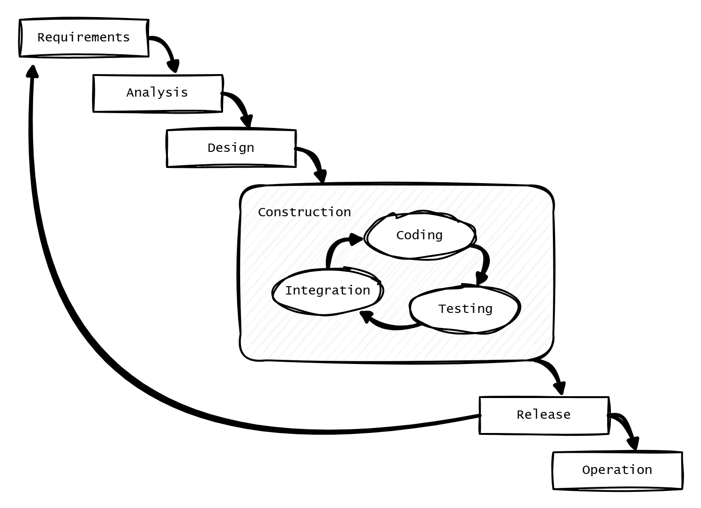

= Develop iteratively and incrementally

Designing for change is about more than just code, though. It is also about _how_ we make software.

We cannot separate design from process. The methods and tools we use to develop software directly impact its design.

The best way to design software for change is through an *iterative and incremental development* process. The idea is to develop a product through repeated cycles (iterations), building it in small portions (increments). In each cycle, we further develop user-facing functionality while evolving the design to better accommodate the system's new capabilities.

This development model is powerful because it can be driven by *feedback loops*. We can adjust product roadmaps based on early and regular user feedback, and in response to changing business requirements, new technologies, and new insights learned from our own experience of building the software.

There are lots of different types of feedback loops, and the more of them we implement, the better quality feedback we get – improving our decision making. An iterative and incremental development process also supports experimentation and innovation, which are essential for solving complex and ambiguous problems.

Critically, an iterative and incremental development process gives us the flexibility we need to *embrace change*. The feedback loops built into the process allow us to continuously refine our understanding of the requirements and adjust the design of the software in response. In each new cycle of development, we can revisit and revise our plans based on what we've learned so far.

In an iterative and incremental development process, requirements can be _allowed_ to emerge.

''''

An alternative approach to dealing with the inherent unpredictability of software projects is to try to lock down the requirements early. By doing extensive requirements gathering, detailed design work, and thorough delivery planning ahead of the construction of the software, you can reduce the odds that changes will need to be made to the project plans later. Costs and timelines for construction can be estimated with greater confidence, too.

In the IT industry, any development process like this is colloquially known as being "waterfall" or "stepwise". A waterfall development process sees each phase of the development lifecycle be done in a sequential, or cascading, manner.

A single waterfall cycle may see a whole new software product developed from scratch, or (more commonly) a major new feature integrated into an existing product. Within a waterfall cycle there may be smaller cycles of development and testing sandwiched in the middle, but the overall process puts emphasis on getting requirements specifications finalized and comprehensive designs signed-off before construction begins. Once construction is done, a complete finished solution is released in one *big bang*.

.A stepwise, or waterfall, development cycle

Waterfall processes are appealing because they give the impression of enforcing order on chaos – of making software development seem more predictable and manageable. But it's an illusion. The reality is that waterfall development processes have proven to be risky and expensive – especially for complex and large-scale software projects.

Waterfall processes involve protracted up-front planning phases, which add overhead and extend delivery schedules, increasing costs and delaying time-to-market. Waterfall processes stifle innovation by leaving no room for experimentation. They encourage *over-engineering* – building features that users don't actually need, and designing complex solutions where simpler ones will do. And, because software updates are released in big batches, feedback loops are extended, meaning gaps in requirements and flaws in designs are discovered late, increasing the cost of making corrections.

Waterfall processes are popular in organizations with top-down, command-and-control management styles. They are characterized by lots of bureaucracy, rigid stepwise phases, and centralized change management procedures. You often see developers assigned to tasks like estimation and scheduling, diverting their attention from the essential job of delivering useful working software to customers. Worse, technicians get taken away from any decision making concerning the software they're responsible for making, seeing their jobs reduced to the production of code. This breaks critical feedback loops, and software design is restricted to solving immediate problems rather than planning for change.

Most fatally of all, by fixing budgets and schedules at the start, waterfall processes discourage requirements from being allowed to change. Inevitably, *scope creep* happens, as more requirements are discovered after construction has begun. If budgets and schedules are not adjusted in response to those changes in scope, then quality suffers. And when quality suffers, changeability is reduced, increasing the cost of future changes.

Fixing the costs and timeframes for software construction is a false economy. It leads to suboptimal solutions that are more expensive to maintain and develop further.

Waterfall processes are unsuitable for most software projects. Unless the requirements can be guaranteed to be complete, precise, and stable from the start, waterfall only creates an illusion of project control while undermining flexibility and quality, and masking inefficiencies and hidden costs.

This is why so many software projects go over budget and over schedule, or otherwise fail to meet the needs of the target users. It's rarely for lack of technical expertise. It's because so much software is developed under an ill-suited process.

''''

No matter how much we invest in up-front planning, we will always be wrong about some things. Software development is a wicked problem. Requirements are emergent for all sorts of reasons. Even if we are successful in locking down requirements, there will be lots of nuances in the many trade-offs in the design that we can grasp only by testing working software. (Prototypes can certainly help to make better designs decisions ahead of construction. But to validate requirements and designs, there's really nothing better than putting production-grade software in the hands of real users.)

The waterfall development model is fundamentally flawed because it treats software development as a construction process rather than what it actually is – it's a design discipline, involving lots of creative thinking, experimentation, and problem-solving. The construction of program code is only a small part of the overall process, and a relatively trivial one at that.

Waterfall deals with uncertainty by trying to eliminate it, but uncertainty is an intrinsic characteristic of any kind of product design process – it cannot be eliminated.

''''

Instead, we should tap into the great strength of software – it's malleability. We should design our software to be easily changed, so we can develop it iteratively and incrementally, in collaboration with its users.

Real users should constantly evaluate the evolving product, guiding its development based on what they actually need and want out of it. Wasted effort is minimized because we only build what users truly value. Feedback loops are short, so we can quickly adapt to changing requirements and new insights. Risks are reduced because problems are discovered early, when they are cheaper to fix. Experimentation is supported, allowing discovery of innovative solutions to complex problems. And changeability is maintained over the long term because the design evolves in lockstep with the software's capabilities.

Almost all successful software projects are constructed in small steps guided by continuous user feedback. Iterative and incremental development offers a long-established framework for doing this.
