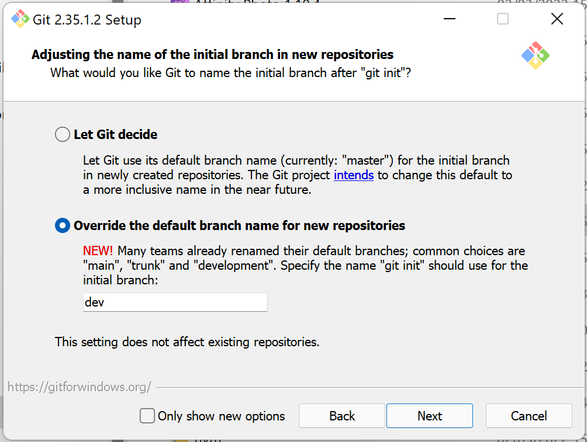
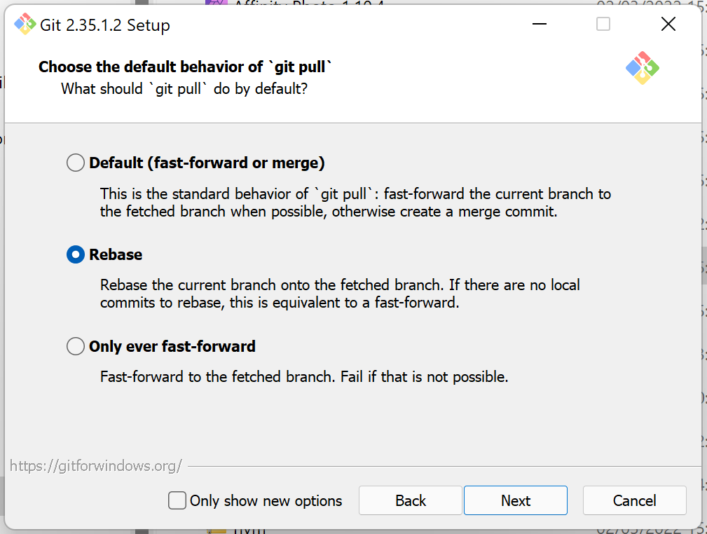

= TS-3: Source Control
:toc: macro
:toc-title: Contents

This technical standard covers the use of source code management (SCM) systems, also known as source control or version control systems.

toc::[]

== Scope

The scope of this technical standard is constrained to source code repositories that are used to encapsulate changes in the code and configuration of software applications, services, and libraries, and also infrastructure configuration.

Code repositories may be used for other purposes, such as for technical documentation, requirements specifications, and other artifacts. These repositories do not need to adhere to the committing, branching, and merging strategies described in this technical standard.

It is RECOMMENDED that repositories that store only non-executable, non-software artifacts have a default branch named `main`, and that their committing and branching conventions be documented in the repository README.

[TIP]
======
Use `git log --no-merges` to see recent commits, and the particular commit message conventions for the current repository.
======

== Terminology

This technical standard uses railway metaphors in its explanations of source control branching-and-merging strategies. *Mainline tracks* are perpetual branches that represent the main line of progress. Many Git workflows have just a single mainline track, which is invariably named `main`, `master`, `develop`, or `trunk`. But it is also possible, as with railway lines, to have multiple mainline tracks running alongside each other, with *merge points* along their routes where they are synchronized.

Continuing the railway metaphors, *side branches* are short-lived branches that branch off the mainline tracks before merging back in later along the line. In source control systems, side branches are used for parallel development of software features, fixes, and other changes in code and configuration.

== Source control systems

https://git-scm.com/[Git] is the _de facto_ industry standard for source control. It is RECOMMENDED for use in software projects. However, similar decentralized source control systems such as https://www.mercurial-scm.org/[Mercurial] and https://fossil-scm.org/[Fossil] MAY be used instead.

Issue tracking systems SHOULD be integrated with source control Using a combination of the two systems makes it much easier to manage and track changes in source code and configuration. See also *link:./002-issue-tracking.adoc[TS-2: Issue Tracking]*.

In addition, CI/CD systems SHOULD be integrated with source control. This is the basis for continuous integration and continuous delivery practices.

All-in-one devops toolchains such as https://github.com/[GitHub], https://about.gitlab.com/[GitLab], https://azure.microsoft.com/en-us/products/devops/[Azure DevOps], and https://www.atlassian.com/[Atlassian]'s software suite, provide deep integrations between source control, issue tracking, and CI/CD systems, while https://fossil-scm.org/[Fossil] embeds bug tracking directly into the source control system itself. It is RECOMMENDED to use tools like these, as they allow for a higher level of automation in development and operations workflows.

Source control systems are also the basis for continuous integration and continuous delivery practices. CI/CD systems should be integrated with the source control system.

== Objectives

Git is unopinionated about how it is used. There are many different ways to organize repositories, manage branches, handle merges, and log revisions. The particular source control conventions recommended in this technical standard are designed with the following objectives in mind.

****
Not all of these objectives can be met exclusively through design of the source control workflow. There are implications for software architecture, for example. Achieving continuous integration and delivery, and especially continuous deployment, will require some kind of feature flag system to be built-in to the software.
****

=== Parallel development

One of the primary use cases for source control is to support multiple parallel work streams on the same codebase.

A source control workflow should not overly restrict this, but parallel development should not be entirely unbounded, either. A well-designed source control workflow should introduce _just enough_ friction to avoid some of the risks associated with parallel development, such as the occurrence of merge conflicts between multiple branches of diverging changes.

=== Low risk

Merge conflicts can be time-consuming to resolve and they increase the likelihood of bugs and regressions reaching production. They should, therefore, be avoided.

The occurrence of merge conflicts is a failure of the software delivery process. But the distributed nature of Git, which gives us the flexibility to check out and make different changes to the same files at the same time, places the responsibility on development teams to reduce the occurrence of merge conflicts. This requires careful planning of the sequencing of changes and their subsequent integration.

=== Keep it simple

Software projects are more likely to be successful if the development process is robust. Robustness is achieved by keeping the process simple and intuitive. Good workflows can be repeated over and over again with low likelihood of error.

In practical terms, this means that individual contributors should need to know only a small subset of `git` CLI commands, and they should need to perform only a small number of manual operations.

=== Continuous integration

All work-in-progress should be integrated into shared mainline tracks at regular intervals. Ideally, the work-in-progress of each individual contributor should be integrated at least once a day.

This means that most side branches should be short-lived (with limited exceptions, such as for proof-of-concept work).

Continuous integration has many, many benefits, one of which is to further reduce the occurrence of time-sucking merge conflicts between parallel development streams.

=== Continuous delivery

It should be possible to _immediately_ deploy to production – or to production-like environments such as staging servers or canary channels – the latest stable revision of the software under source control.

Production deployments should be fast and highly automated. It should not be necessary to wait for builds to complete or tests to pass. This allows production services to be rebuilt quickly. For example, fast rollbacks can be done in response to incidents.

=== Continuous deployment

Continuous deployment is not appropriate for every software product, but where it is appropriate the source control workflow needs to support frequent deployments to production (or other production-like environments).

The aim is to avoid big bang releases. Instead, a continuous deployment process ships lots and lots of very small changes.

Shipping to production regularly reduces risks of regressions and incidents in production, and makes it easier to identify the root cause of any issues that _do_ arise in production (because the last release's diff is always small).

=== Fast rollback

Continuous deployment also requires fast reproducibility of _prior_ versions of the software under source control.

If an incident occurs in production after a release, it needs to be easy to rollback to the last known good version _as quickly as possible_, and with a high degree of confidence that the rollback will be successful.

This process should be automated as much as reasonably possible.

The alternative, to fix forward, always requires some degree of manual labour, and can therefore never be as well automated as rollbacks.

Fast rollbacks depend on prior versions maintaining stability indefinitely. In other words, it should be possible to recreate _any prior version_ of a system, at any time now or in the future.

=== Fast feedback

The source control workflow should support the automated use of tools that give us fast feedback on the _quality_ of our evolving software.

In particular, static and runtime tests should be run on every commit, rather than be delayed until the point of integration. (This constraint may be relaxed to reduce excessive devops infrastructure costs.)

=== Automation

Source control workflows should be designed to support a high degree of automation of other recurring development and operations procedures. For example, we should be able to easily automate repetitive tasks such as the generation of release notes and changelogs, the bumping of version numbers, the management of secrets and feature flags, and so on.

Automation is a key enabler of our ability to deliver software quickly and safely. It reduces the risk of human error and allows us to focus on the problem-solving and creative aspects of our work, and less on the mundane bits.

Automation increases productivity and makes development work more enjoyable and rewarding.

To optimize the potential for automation, sufficient metadata needs to be embedded in commit objects, branches, and tags.

=== Quality gates

Out-of-the-box, a source control workflow should be lightweight and as frictionless as possible. But the trick to optimizing development velocity is to build in _just enough_ friction to maintain stability in the evolving software. Development velocity will decrease if the quality of the system is allowed to incrementally deteriorate.

So, a source control workflow should be designed to maximize the utility of Git's lightweight branching and merging operations, but also to allow quality gates to be added as appropriate for each project.

=== Provenance

Each and every feature deployed to production should be traceable back to a business requirement, bug report, or incident that initiated the change.

This can be achieved by tightly integrating the source control and issue tracking systems.

If we enforce a strict two-way binding between tasks in the issue tracker and changes in the source control system, we'll be able to query Git for all changes related to a particular issue, and we'll be able to query the issue tracking system for all requirements related to particular changes logged in a repository's revision history.

=== Clean history

The output from `git log` should produce a clean and meaningful changelog, with clearly signposted release points. This log output should be both human-readable and machine-parsable, so changelogs can be auto-generated in other presentation formats such as web pages.

This is necessary to be able to meet the previous objectives of automation and provenance. More than this, a repository's log is an important artifact in its own right.

Clean code and clean logs complement each other. A clean codebase helps to understand the current state of a system, but this is only a snapshot in time. A clean commit log gives us visibility of a project's history, and so helps us to understand the context in which the current code exists.

=== Scalability

Finally, it should be possible to scale the Git workflow from small hobby-scale projects to large-scale enterprise applications. The idea is that a baseline workflow – which requires just a single branch – can be incrementally extended with opt-in features and procedures, as necessary to scale a project.

== Git configuration

It is RECOMMENDED that developers set the following configurations in their user-level `.gitconfig` file.

=== core.autocrlf

[source,ini]
----
[core]
  autocrlf = false
----

This setting tells Git not to transform line endings to CRLF (Windows' native line ending format) when files are checked out from a remote repository to a local repository on a Windows system. Doing such a transformation is unnecessary since all modern code editors can be configured to support Unix line endings (LF), and this can also be enforced at the repository-level using tools like https://editorconfig.org/[EditorConfig].

=== core.eol

[source,ini]
----
[core]
  eol = lf
----

This setting tells Git to normalize line endings to the Unix standard (LF) on all files that Git auto-detects as being text-based. This is equivalent to adding the following rule to `.gitattributes`.

[source,ini]
----
* text=auto eol=lf
----

=== init.defaultBranch

The branching-and-merging workflow described in this technical standard recommends the use of a default branch named `dev` (or `latest/dev` where multiple software versions are maintained in parallel). The following setting will tell Git to use this name for the default branch (replacing `main` or `master`) whenever you initialize (`git init`) a new repository.

[source,ini]
----
[init]
  defaultBranch = dev
----

This option can also be set via the installation wizard for Git for Windows.

=== pull.rebase

On `git pull` operations, it is RECOMMENDED to always rebase the current branch on top of the upstream branch after fetching. This helps to maintain a clean, linear history, and to ensure a consistent chronology of commits between local branches and the remote branches they track.

But this is not Git's default behavior, so to perform a pull operation with the rebase strategy you need to explicitly add the `--rebase` flag:

----
$ git pull --rebase
----

You can make the `--rebase` flag the default behavior by adding the following setting to your `.gitconfig`:

[source,ini]
----
[pull]
  rebase = true
----

Now every `git pull` operation that you run locally will use the rebase strategy, as though you had explicitly provided the `--rebase` option.

An alternative strategy is to use the `--ff-only` flag on `git pull` operations.

[source]
----
$ git pull --ff-only
----

This ensures that the local branch will be fast-forwarded to the upstream branch, and there will not be an explicit merge commit added to the local branch. If there is divergent work in the upstream branch, the pull operation will simply fail, forcing you to do an initial `git rebase` on the upstream branch. The end result is the same: a linear commit history is maintained, and the chronology remains consistent between local branches and the remote branches they track.

If you prefer the fast-forward-only strategy, you can make the `--ff-only` option the default for all `git pull` operations by using the following configuration. This option overrides both the `pull.rebase` and `merge.ff` options.

[source,ini]
----
[pull]
  ff = only
----

Both strategies – rebase or fast-forward-only – can be enabled via the installation wizard for Git for Windows.

[NOTE]
======
Even with these options set in your `.gitconfig`, this may not change the default behavior of Git GUIs, such as those built into code editors like IntelliJ or VS Code. You may need to adjust equivalent settings for the Git GUIs you use, too.
======

== Repositories

All changes in code and configuration MUST be captured in a source code management system, either Git or another SCM with an equivalent featureset.

For each repository, there MUST be a single centralized repository that is the "source of truth" for the codebase. This is known as the *reference repository*.

All contributors MUST implement changes in copies of the reference repository, which are downloaded ("cloned" in Git-speak) to the developers' local development environments. These clones are called *local repositories*.

For public open source software projects, some contributors will have read-only access to the reference repository. In this case, the external contributors must fork the reference repository to another Git server under their control, before cloning their fork to their local development environment. This is known as the *fork-and-clone workflow*.

The reference repository and its forks are collectively known as *upstream repositories*, because they are upstream to the local development environments where changes are implemented. The upstream repositories are hosted on central servers, usually managed by a hosting service provider such as GitHub or GitLab.

A local repository provides an isolated development environment, allowing multiple contributors to work in parallel. Changes MUST be committed first to local repositories before they are synchronized with ("pushed" to) the upstream repositories they track.

The goal is for developers to be able to check out a repository, run some scripts stored in the repository, and quickly have a complete working application running in a local development environment – all configured in the repository itself. This process should not be dependent on any external dependencies, including code and configuration from other repositories.

In addition, developers SHOULD be able to checkout _any prior version_ from a repository's history and be able to build, run, test, and deploy that version – without relying on any external dependencies that are not configured at the same version point in the same repository.

Thus, if an application calls other external systems or services, it MUST be possible to operate the application without error when those external systems are unavailable. One possible solution involves having a "development mode" or "test mode", under which the running application uses mocks in place of external dependencies.

These constraints ensure the reproducibility of builds and deployments, supporting continuous deployment and automated rollback practices. For the ultimate guarantees over stability of prior releases, development teams may consider checking in to source control the _actual_ vendor libraries and other local dependencies used by the application, instead of checking in merely a package manager configuration. The latter approach does not guarantee that the dependencies can be recreated in the future (because there are no guarantees they will continue to be available from the configured package registry).

=== Repository scope

The boundaries of code repositories SHOULD NOT be arbitrary. A repository is not merely a container for a random assortment of code. Rather, the boundaries of repositories SHOULD reflect the boundaries of software components – applications, services, or libraries – with a repository encapsulating all relevant application code and configuration, tests, requirements specifications, technical documentation, user documentation, infrastructure configuration, and any other artifacts that are relevant to that software component.

Within multi-team organizations, the boundaries of repositories should also map to the boundaries of responsibilities of the teams. Each repository SHOULD be owned by exactly one team. One team MAY own more than one repository, but all repositories under a single team's ownership SHOULD be closely related (eg. fall under the same business subdomain or bounded context).

=== Mono-repos

The scope of a repository SHOULD correspond to the boundaries of a discrete software component. That component MAY be part of a wider system of components, perhaps a distributed system, but each repository MUST encapsulate _one or more_ components that can be started and run together, without requiring other components or dependencies from other repositories to be present.

Mono-repos MAY be used to encapsulate two or more related software components. Mono-repos are REQUIRED where two or more software components are so tightly coupled that they must always coexist – ie. the components must be built, run, tested, and deployed together.

Keeping coupled components together means that changes to one component can be easily made in the context of the other components that depend on it. This can help to manage breaking changes, and it maintains the principle of each repository encapsulating everything that is needed to build, run, test, and deploy a complete working application (even if that application is actually one subsystem of a larger distributed application).

[IMPORTANT]
======
The boundaries of repositories SHOULD represent the boundaries of highly coupled components.
======

All components in a mono-repo SHOULD have the same version numbers. Within a repository, everything at the same revision SHOULD work together. This means that the repository itself can be tagged with release points (rather than these being captured in code and configuration within the repository's contents, which would be necessary for multi-versioned components).

Using repository-level versioning signifies the tight coupling between the software components maintained in the repository, and thus the need to version them together. A mono-repo may encapsulate the code and configuration for two distinct microservices that are each deployed to different infrastructure. If updates to those microservices must be coordinated due to some kind of tight coupling between their APIs, or perhaps due to shared persistence layers, then those microservices SHOULD be maintained together in the same repository.

[IMPORTANT]
======
Use version control to control the versions that go together.
======

It SHOULD be possible to run a complete deployment operation from a single repository, without requiring coordination with other deployments from other repositories.

Within a mono-repo, different components MAY be written in different programming languages and/or target different runtime environments. For this reason, the code and configuration of a mono-repo MAY follow differing coding standards.

=== Repository naming conventions

A clear repository naming convention, standardized across teams and projects, makes it easier to:

* Quickly identify the purpose and content of a repository.
* Search and retrieve repositories more effectively.
* Share workflow automations (eg. CI/CD workflows could dynamically adjust based on a repository's name).

It is RECOMMENDED to:

* Prefix repositories with the name of the team, subdomain, or project. Betters still, use internal codenames to identify projects, which will not change even if a team name changes or if the public-facing branding of a product changes. For example, a repository named `zeus_website` may encapsulate the source code for a website for a company called "Initech", where "zeus" is the internal codename for that company. The company can change its brand name and you won't need to update lots of code and configuration to reflect that change.

* For repositories that are not scoped to any particular project or team, but which are relevant to the whole organization, use a generic prefix like `common__`, `shared__`, or `global__`, or the name of the organization itself.

* It is best practice to encapsulate all code and configuration for a discrete software component in a single repository, but where this is not possible consider using a consistent repository name but add a suffix to identify the specific contents of each repository, eg. `--app`, `--db`, `--config`, `--docs`, `--infra`, `--lib`, `--test`, `--tool`, etc.

* If different versions of a software component are maintained in different repositories, append the repository with a version identifier, eg `-legacy`, `-next`.

* Use lower case ASCII letters only. Avoid including numbers and do not include special characters. Use hyphens to separate words in the repository name.

* Do not reference the technology stack in the repository name. The technology stack is an implementation detail that can change over time, and it does not really help to identify the contents of the repository. Repository names SHOULD be short but descriptive of the _domain_ of the software component, rather than descriptive of the solution or technology. If you want to identify the technology stack, hosted repository services like GitHub and GitLab also you to add descriptions, metadata, labels, tags, or topics to repositories.

Examples:

----
global__requests-for-comments
global__technical-standards
zeus__http-api-v1
zeus__http-api-next
zeus__website--app
zeus__website--db
zeus__website--infra
----

=== Preparing new repositories

To prepare new Git repositories, it is RECOMMENDED to first create the upstream reference repository. This is done via GitHub, or whatever Git hosting service is being used.

Clone the reference repository on your local machine. It is RECOMMENDED to use the SSH protocol. Example:

----
$ git clone git@github.com:/{team}/{repo}.git
----

Alternatively, create an empty directory on your computer, change to that empty directory, and then initialize a blank Git repository within it.

----
$ mkdir {repo}
$ cd {repo}
$ git init
----

When you directly `git clone` an upstream repository, Git assigns the identifier "origin" to reference the upstream repository from where the clone originated. This doesn't happen when you initialize a Git repository from scratch, so you must run the following command to manually configure the location of the upstream repository.

----
$ git remote add origin git@github.com:/{team}/{repo}.git
----

Before you can set up the branches, you need to have some files to commit. Start by creating the project's README.

----
$ touch README.adoc
$ echo "= [Project Title] >> README.adoc"
----

Now stage it.

----
$ git add README.adoc
----

And commit it.

----
$ git commit -m "chore: add readme"
----

When you committed the README file, Git would have created a default branch called `master` or `main`, depending on how Git is configured on your computer. As per the branching conventions documented below, it is RECOMMENDED to use a default branch called `dev` (or `latest/dev` if multiple versions of the software will need to be maintained in parallel, eg. to enable long-term support). You can use the `git branch -m` command to force the current branch to be moved (ie. renaming it).

----
$ git branch -m dev
----

Push the new branch up to the reference repository. Use the `--set-upstream` option, or its alias `-a`, to have the local `dev` branch track a branch of the same name in the remote repository.

----
$ git push --set-upstream|-u origin dev
----

Because this will have been the first time that anything is committed to the upstream repository, the `dev` branch should have been automatically set as the default branch. You can check this by inspecting the settings for the repository in GitHub or GitLab.

These are the minimum requirements to prepare a new repository. Optionally, additional branches can be created, as required. See the *Branches* section, below, for details on OPTIONAL branches. For example, to create the production branch:

----
$ git branch prod
$ git checkout prod
----

These two commands can be combined into one:

----
$ git checkout -b prod
----

Alternatively, from Git v2.23 you can use the new `git switch` command with the `--create` or `-c` option:

----
$ git switch --create|-c prod
----

Remember to push all the branches you create into the reference repository, setting up tracking with your local repository.

----
$ git push --set-upstream|-u origin prod
----

Use the `git branch` command to view all the local branches you have created. Use the `--all` or `-a` option to view remote-tracked branches, too.

----
$ git branch --all|-a
----

== Committing

The following is a guide to the best practices for committing changes to a source code repository.

Clear and structured commit messages make an important contribution to the internal quality of a software system. The output of `git log` is a valuable artifact in its own right. Most crucially, it is the most useful artifact for understanding the evolution of a codebase over time, and for discovering the rationale behind past design decisions. This all helps to understand the context in which the current code exists.

A repository's commit history is also likely to endure for longer than other artifacts such as issues (issue trackers may be replaced) and decision logs (which can have a tendency to grow stale over time).

Consistent commit message formats support greater automation of recurring development and operations tasks. And useful, detailed commit messages also make tools like `git blame` much more useful. Overall, good commit hygiene greatly improves the maintainability of a software system.

_"Clean commits" is as important as "clean code"._ Committing SHOULD be done deliberately, strategically, and with the same care and attention to detail as given to the code itself.

=== Language

Commit messages MUST be written in American English using only ASCII-US characters.

=== Atomic commits

The foundation of a clean and searchable commit log is the concept of atomic commits.

An atomic commit is a small, self-contained, incremental change to a codebase that does not break the build or fail any tests. A commit does not necessarily represent a "complete" feature, bug fix, or performance optimization, but it does represent a small logical step toward one of those outcomes.

When implementing changes, developers SHOULD commit one small change at a time. Large changes SHOULD be split into smaller partial, but stable, changes. Lots of small, discrete changes are  preferred to a smaller number of large, monolithic changes.

For example, an atomic commit may add a small piece of new logic, hidden behind a feature flag, and some unit tests to cover it. Additional commits may be required – eg. to extend the coverage of the higher-level tests, to update the technical documentation, and ultimately to disable the feature flag – for the feature to be considered "done".

Changes to application code SHOULD be committed alongside changes to automated tests – just enough to verify the correctness of the code changes. An important constraint of atomic commits is that each commit is self-contained and could therefore be reverted independently – without requiring any older commits to be reverted, too. If code and tests are committed independently, they're not atomic commits, because they are coupled.

Critically, in each commit, both static and runtime tests SHOULD pass, and the build SHOULD succeed, too. This means avoiding commits that "fix the tests that were broken in the previous commit". The golden rule for every commit is: _don't break the build_.

It is RECOMMENDED to automate the running of tests and the build on every commit. https://git-scm.com/book/en/v2/Customizing-Git-Git-Hooks[Git hooks] can be used to enable this.

In general, the smaller the individual commits, the better. If your commits are too granular, you can always squash them together. But it is harder to do the opposite – to split a large commit into smaller ones.

Ideally, a commit SHOULD be scoped to a single concern and technology layer. For example, database schema changes SHOULD be committed separately from application code changes, and back-end service changes SHOULD be committed separately from front-end GUI changes, and so on. However, this constraint often comes into conflict with the other constraint of keeping the build stable. Authors SHOULD prefer larger commits, with changes across multiple technology layers if necessary, if that is what is required to not break the build.

[quote, The Git project]
____
Each commit is a minimal coherent idea.
____

Achieving atomic commits requires a disciplined approach to implementing code changes. But there are numerous advantages for the extra effort.

Small, incremental changes are easier to understand when it comes to code review. They also make it easier to track the history of the codebase and to identify the purpose of each change.

Atomic commits also allow for continuous integration. Small, incremental, stable changes can be regularly integrated into shared mainline tracks, reducing the risk of integration conflicts ("merge hell"). Atomic commits also make it easier to revert specific changes, and "fixing forward" by adding revert commits is often the quickest way to resolve production issues.

=== Commit types

To help enforce the constraint of atomic commits, each commit MUST be scoped to exactly one of the following ten types:

1.  *feature*
2.  *performance*
3.  *fix*
4.  *dev*
5.  *refactor*
6.  *maintenance*
7.  *chore*
8.  *release*
9.  *merge*
10. *revert*

A *feature* is a change in a user-facing operation or behavior of the software. Feature commits will typically toggle on an external feature, such as enabling a new API endpoint. This type of commit also covers changes and extensions to existing features, and the deprecation and removal of old features.

While feature commits implement new functional requirements, *performance* commits capture the implementation of non-functional requirements. The term "performance" is used broadly here, to refer to all operational qualities, also known as dynamic quality attributes, such as security, responsiveness, reliability, resilience, and so on.

Both features and performance optimizations are user-facing changes. However, not all performance optimizations will be observed by users in any kind of quantifiable way. For example, the implementation of more concurrent processing may reduce the operational costs for the software vendor, rather than reduce latency for users.

A *fix* is any change that resolves some sort of defect – whether a bug, regression, incident, or just an entry in an error log. It is not necessarily the case that the defect was exposed to users, but it's something that needed fixing nonetheless.

Features, performance optimizations, and fixes will typically be associated with issues logged in the project's issue tracking system. They will also be of interest to users and other stakeholders, and may therefore be recorded in user-facing artifacts such as release notes and changelogs.

The remaining commit types capture changes that are not directly user-facing and which are mostly of interest to the developers and maintainers of the software.

''''

Typically, there would be a number of incremental changes to code and configuration before a feature, performance optimization, or fix is complete and enabled in the software. These incremental steps are general *dev* work. Individual dev commits should not change the user-facing operations or performance of the software, but rather represent increments toward those changes being enabled.

A *refactor* is any improvement to the formatting, design, or internal structure of the code or the system configuration, without changing the software's features or regressing its performance. Refactoring work includes changes to automated tests and build scripts, as well as to source code and production configuration.

.Performance optimization versus refactoring
****
Performance optimization and refactoring are both concerned with improving the _quality_ of the software, but they focus on different quality attributes (defined as non-functional requirements).

Performance optimization addresses qualities like availability, consistency, latency, security, and compliance requirements. These are _external_ quality attributes of a system, because they impact the user experience. They are also _dynamic_ quality attributes, because they tend to emerge at runtime.

Refactoring is about making improvements to the _internal_, _static_ qualities of a system – things like choices of technologies, design patterns, data structures, and coding conventions. These are qualities that emerge at compile time (or earlier) and that impact the developer experience. The focus of refactoring work is on the needs of the developers and maintainers of the software, whereas the focus of performance optimization is on delivering better quality user experiences.
****

*Maintenance* commits capture changes that are required in the upkeep of the software – to keep it in good running order. This category of work includes the updating of dependencies and improvements to automated tests. These tasks will typically be recurring, and they may be scheduled in advance (for example, using the issue tracking system) or triggered by external events (for example, a security scanning tool revealing a vulnerability in a dependency).

There also tends to be a lot of smaller housekeeping *chores* around the maintenance of a code repository, such as updating of READMEs and other documentation, applying code formatting rules to code, configuring tools like linters and test frameworks, and changing the configuration of CI/CD pipelines. Typically, chores are not significant enough to be tracked via an issue tracker, whereas larger maintenance tasks normally are. They may not even require peer review, and may therefore be committed directly to the `dev` branch (skipping the pull request process).

Finally, a *release* commit captures a set of changes made in preparation of a new software release. The remaining two commit types, *merge* and *revert*, are required to capture specific Git operations.

// TODO: Add information on mapping between issue types and commit types.

=== Commit message format

To meet the objectives set out at the top of this technical standard, there must be very precise rules for the formatting of commit messages.

The following commit message convention is loosely based on https://www.conventionalcommits.org/[Conventional Commits], which in turn is based on the conventions of the https://github.com/angular/angular/blob/22b96b9/CONTRIBUTING.md#-commit-message-guidelines[Angular project].

Each commit message consists of a header, a body, and one or more footers. Each block is separated by a single empty line.

[source,txt]
----
{header}

{body}

{footers}
----

=== Commit message header

The header has a special format that includes a type and a description, separated by a semi-colon and exactly one space. There is an OPTIONAL flag on the end, delimited by a spaced hyphen.

[source,txt]
----
{type}: {description} (- {flag})

{body}

{footers}
----

The `{header}` is the only REQUIRED component of a commit message. The `{type}` part MUST be one of the following words, which map to the different types of commit concerns listed above:

1.  `feature`
2.  `performance`
3.  `fix`
4.  `dev`
5.  `refactor`
6.  `maintenance`
7.  `chore`
8.  `release`
9.  `merge`
10. `revert`

Using predefined type identifiers as a prefix for commit messages makes it easy to filter out unimportant changes (like chores) using `git bisect`.

The description SHOULD be a short message that summarizes the change. This SHOULD be written all lower case, with no period (full stop) or other punctuation to terminate the statement. Generally, there SHOULD NOT be multiple distinct changes in a commit, but if there are, the descriptions of each change SHOULD be separated by a comma.

The objective is for the command `git log --oneline` – which only outputs the header part of commit messages – to produce an easily readable, high-level view of the sequence of incremental changes. Example:

----
a1b2c3d chore: initial commit, add readme
d4e5f6g dev: add openapi specification
h7i8j9k fix: invalid yaml formatting
b9r5y8t refactor: move openapi spec to resources directory
c2c6a8w chore: proofread readme content
b3e5r7t feature: enable route to openapi spec
e3r5t7y release: v0.0.0-beta
----

Separating discete development concerns – feature delivery, bug fixes, performance optimization, refactoring, etc. – into separate commit objects helps to enforce the principle of atomic commits, and all the benefits that go with that.

Many other Git UIs will also show only the first line of the commit message. The header of a Git commit message functions a bit like the subject line for an email message. The header of a commit should convey just enough information for the reader to understand the contents of the commit object.

To improve the readability and usefulness of this output, commit headers SHOULD be written in the imperative mood in the present tense. This means writing commit messages as though you're giving a current command or instruction. So you should write "change" not "changed" or "changes", and "update" not "updated" or "updates".

This written style is not intuitive at first, because you tend to write commit messages as a log of something that _you_ have recently done (past tense). But it's better to think of a commit message as a description of the impact that applying the commit will have on the software under source control. Commits are not so much records of past actions, but rather they are states that can be checked out, merged, reverted, or cherry-picked at any time.

Consider the following two examples:

----
✗
refactor: removed deprecated prefixes from vars

✓
refactor: remove deprecated prefixes from vars
----

The difference is subtle, but the second makes more sense in most of the contexts in which a Git log is consumed. This style is also consistent with how Git itself generates messages for operations like `merge`, `revert` and `rebase` – it writes "merge" not "merged", and "revert" not "reverts", etc.

If written correctly, the `{description}` part fo the commit message should complete this sentence:

[quote]
____
If applied, this commit will {description}.
____

Generally, the `{description}` SHOULD start with a verb describing the _action_ that is being taken by applying the commit. There are some exceptions. Bug fixes need only describe the _problem_ that is being fixed. And release commits can simply give the version number of the release.

----
fix: invalid yaml formatting
release: v0.0.0-beta
----

The maximum length of the header line (prefix + description) SHOULD be 50 characters and MUST NOT be more than 72. (Only `revert` commits, which are automated, are excluded from this rule.) The purpose of this constraint is for `git log` output to be readable in most contexts. If the header line is long, it may be truncated in printed output. If you use Vim as your commit message editor, it already knows about 50 characters being the recommended soft limit for Git commit subject lines, which is why the color changes after the 50th character by default.

==== Flags

The header line of a commit message MAY include an optional flag on the end. When included, the flag is demarcated from the description by a spaced hyphen:

[source,txt]
----
{type}: {description} - {flag}
----

Flags are a single word, written in full capital letters, which MAY be one of the following:

* `BREAKING`
* `WIP`
* `EXPERIMENT`
* `TEMPORARY`

Additional flags MAY be added as required for a project.

==== Breaking changes

The "BREAKING" flag MUST be used to signpost breaking changes that are introduced to the software or its internal code. Example:

----
22a36c7 dev: remove password from login action - BREAKING
----

The concept of a breaking change differs depending on the context in which the "BREAKING" suffix is used. In the example above, the breaking change is applied to a `dev` commit. This denotes that the changes include one or more breaking changes to _internal_ APIs. Internal breaking changes include changes to function signatures, data structures, event schemas, and facades to dependencies and third-party systems. The purpose of marking internal breaking changes is to draw the attention of other developers who may be working on parallel changes that will break once their changes are integrated with yours, due to shared code and configuration.

When the "BREAKING" suffix is added to a `feature` commit, it's semantic meaning changes. Features represent user-facing functionality, so a "breaking" feature is one that introduces a breaking change to a public API. Example:

----
24b3g40 feature: remove password from login endpoint - BREAKING
----

Commit messages capture information that is primarily of interest to other software developers, not to the users, customers, or other stakeholders of the software. This is why breaking changes to both internal and external APIs ought to be flagged in commit messages. The "BREAKING" suffix on `feature` commits MAY be used by automation tools to automatically bump major version numbers, or to validate that a user-supplied version number is appropriate (see *link:./005-versioning.adoc[TS-5: Versioning]*). But, for users of the software, other artifacts such as changelogs, release notes, and interface definitions will often be more appropriate places to communicate breaking changes in external APIs. This requires manual intervention, rather than reliance on automation, which is more appropriate for such an important decision.

Where the "BREAKING" flag is included in the commit message header, use the message body to describe the change, the justification for breaking client APIs, and consequences for migrations, etc. See below for more information on writing commit message bodies.

==== Work-in-progress (WIP)

The "WIP" flag is used to signpost changes that are a work-in-progress.

Commits that "break the build" – ie. when static or runtime tests fail, or compilation fails – MUST be flagged as "WIP".

In the following example, a WIP commit is followed by a stable one.

----
c0d1e2f dev: extend search algorithms
a1b2c3d refactor: rewire search algorithms - WIP
----

WIP commits serve a couple of purposes.

First, it is not always possible to implement a clean, stable change in a single, small, atomic commit. Sometimes, no matter how disciplined you try to be in your committing, development tasks becomes necessarily messy. Including intermediate WIP commits, initially via side branches, provides a solution to keeping individual changes small while implementing large, destructive changes.

Second, WIP commits can be used to backup work that you started, but did not complete, before the end of a working day. You can commit your WIP to a side branch, push to the upstream reference repository for backup purposes, and then resume your work the following day.

[TIP]
======
If you end up with lots of changes in your working tree, which are not all stable, you might still be able to make some stable commits from them, by using `git add -p` to stage only some parts of changed files.
======

WIP commits MUST NOT be committed directly to the `dev` branch (see below for branching conventions). Instead, they MUST be added to side branches, and then merged into the `dev` branch only when subsequent commits "fix the build". Thus, the tip of the `dev` branch always points to a stable commit, though there may be individual WIP commits in the `dev` history that are unstable.

Alternatively, WIP commits can be fixed up before integrating them into the `dev` branch. There are a few different Git techniques you can use to achieve this. One option is to soft reset (`git reset --soft {hash}`) to the nearest stable commit, once you've got a stable build, then create a stable commit to replace the WIP ones. Alternatively you can use `git commit --amend` to recreate the previous WIP commit with your new staged changes. The same result can be achieved using interactive rebasing. Alternatively, WIP commits from a side branch can be squashed into a single new stable commit on `dev`.

All of these options involve changing the commit history, so this can be done only while the WIP commits exist in side branches. Once WIP commits have been integrated into the `dev` branch, it is too late to change them, because the commit history of the `dev` branch MUST be treated as being immutable.

To synchronize your local changes with the tracked side branch in the upstream repository, you will need to use `git push --force-with-lease` to overwrite the WIP commits that still exist in the upstream branch.

==== Experiments

The "EXPERIMENT" flag MAY be used to signpost changes that are experimental in nature. Experimental changes are not intended to be permanent, and are expected to be rolled back (through `git revert`) or otherwise undone. Therefore, "EXPERIMENT" commits MUST be committed only to side branches and MUST NOT be integrated into the `dev` branch (not even via a stable squash merge).

Use cases for experimental commits include adding temporary logging output to help debug a problem, to try an alternative design pattern to implement a feature, or to test a new library.

----
350ca59 revert: dev: add more logging - EXPERIMENT
35c3aef dev: add more logging - EXPERIMENT
----

==== Temporary commits

The "TEMPORARY" flag MAY be used to signpost commits that are not intended to be permanent, and which will be removed from the history before integration with the `dev` branch.

The difference between a "TEMPORARY" commit and an "EXPERIMENT" commit is that the author fully intends to revert a temporary one, whereas an experiment may, in the end, be kept.

=== Commit message body

The `{body}` component of a commit message is OPTIONAL.

[source,txt]
----
{header}

{body}

{footers}
----

The message body is separated from the header by a single empty line (ie. two consecutive line breaks). Multi-line commit messages are not easy to input inline via the `git commit` command. Instead, omit the `--message|-m` option from the commit command. Git will open your default text editor, where you can easily write a full commit message. Simply exit from the editor when you've finished making your changes, and Git will complete the commit operation with the provided message.

The message body MAY be used to provide a longer description of the changes included in the commit, than can be included within the 50-character soft limit on the message header. Use the message body to explain how the new behavior differs from the old, if this cannot be fully understood from the message header on its own.

But the focus of the message body should be on recording the motivation for the changes, any contextual background information that is relevant, and why the changes were implemented the way they were, and if other approaches were considered but rejected. While the header line describes _what_ changed (summarizing the commit's diff), the commit body goes into detail about the _why_.

Use the message body to share any knowledge learnt through the lifecycle of the change, that cannot be intuited from the changes to the artifacts under source control themselves. You might also consider including information about things that the code does _not_ do, and why these things were omitted. Indeed, any information that may be relevant to the future maintainers of the code should be included in the message body.

Do not write redundant information in the message body that can be extracted from the commit object itself. For example, there is no reason to list the files that changed – that can already be deduced from the commit's diff. The message body is for providing any other knowledge or context about the change that would not otherwise be available, and which would risk being lost if not recorded with the change.

The message body can be any freeform text. It should be written in full, proper sentences, terminated by periods (full stops). The body may consist of multiple paragraph, delimited by single blank lines. Bullet lists (in Markdown style) MAY also be included, using hanging indents for wrapped lines.

.Example
----
fix: prevent racing of requests

Introduce a request id and a reference to the latest request. Dismiss
incoming responses other than from latest request.

Remove timeouts which were previously used to mitigate the racing
issue but which are now obsolete.

Reviewed-by: Z
Refs: #123
----

[IMPORTANT]
======
It is important to ensure the message body is delimited from the message header by a single blank line. Some Git operations, like `rebase`, can get confused if the two run together.
======

The length of any individual line SHOULD NOT exceed 72 characters. This is a bit longer than the RECOMMENDED maximum line length of the message header – 50 characters. It provides a bit more practical space for writing out lengthy descriptions, while still benefitting from good readability in terminal output. For example, `git log` doesn't do any special formatting of commit messages. The default pager is set to `less -S`, so long lines will simply flow off the edge of the window. In a traditional 80-column terminal, if we subtract 4 columns for the left indent and 4 more for symmetry on the right, we are left with 72 columns.

=== Commit message footers

One or more footers MAY be included in commit messages.

The footers are a continuous block separated from the message body (or message header) by a single blank line. Individual footer entries within the block are delimited by a single line break.

A footer entry is a key-value pair written in the following format:

[source,txt]
----
{key}: {value}
----

The key-value pair is separated by a colon and exactly one space after the colon.

The `{key}` is a string of contiguous characters, with words delimited by hyphens. The key is case insensitive, so `Reviewed-by` and `REVIEWED-BY` are equivalent. However, by convention, only the first letter of footer keys is upper case, the rest of the string is lower case.

The `{value}` is any freeform text. Values are terminated by a single newline or the end of the document, unless the next line is indented by at least one space character, which denotes a continuation of the value from the previous line (like the "folding" in RFC 822).

Keys do not need to be unique within a footer block. Multiple instances of the same key, each with different values, MAY be included in a commit message's footers.

This format is inspired by the https://git-scm.com/docs/git-interpret-trailers[Git Trailer convention], which itself is inspired by the encoding of headers in email messages (as defined by RFC 822). The `git interpret-trailers` command can be used to parse structured information contained in commit messages in this format. It can also be used to add and customize default trailers that are automatically added to all commit messages.

.Examples
----
Closes: #123
Reviewed-by: Charlie <charlie@example.com>, Dave <dave@example.com>,
  Eve <eve@example.com>
Signed-off-by: Alice <alice@example.com>
Signed-off-by: Bob <bob@example.com>
----

Footers provide structured data used in automation. Therefore, you can specify whatever footers are required for each project's tools.

If you are using GitHub, GitLab, or similar all-in-one DevOps systems, these tools support a `Closes` footer. If the value of the `Closes` header references one or more valid issues in the tracker attached to the repository, the issues will be automatically closed when the commit is integrated into the repository's default branch.

----
Closes: #123, #456
----

It is RECOMMENDED to cross-reference any issues or pull requests that are relevant to the changes being implemented in a commit. If you do not want to close the referenced issues automatically on integration of the changes, you can use the `Refs` footer instead.

----
Refs: #123, #456
----

In all-in-one DevOps systems like GitHub and GitLab, this syntax creates a binding between issues and commits. In Git logs, the issue references will often be automatically linked to the relevant issue URLs. And vice versa: links will be automatically created from the issues to the relevant commits. This automation is incredibly useful.

If the issue tracking system is not integrated with the source control system in your upstream reference repository, you should instead use the full URLs to relevant issues.

This metadata is useful for finding the provenance of changes when auditing the history of a repository – for example, to understand the root cause of a bug that you're working on fixing, or why some changes recently introduced to the project mainline conflict with your work. It will also allow you to query Git for any commits related to a particular issue or PR. Thus, these cross-references help to create a two-way binding between the issue tracking and source control systems.

`Signed-off-by` is another standard footer, which originated in the Linux Kernel project and which is built-in to Git itself. It can be included by adding the `--signoff|-s` option to the `git commit` operation:

----
git commit -s -m "fix: authorization error"
----

This will automatically add the `Signed-off-by` header with the value being composed from the `user.name` and `user.email` fields in the Git config. This is used in some open source software projects as a lightweight mechanism for external contributors to opt-in to "sign" the terms of the https://developercertificate.org/[Developer Certificate of Origin (DCO)], which states that the author has the right to submit the changes and agreed for them to be distributed under the terms of the project's license.

Other footers that you may consider for your projects include:

* `Co-authored-by`
* `Reviewed-by`
* `Tested-by`

=== Merge commits

Merge commits are generated automatically by Git on `git merge` operations. It is not possible to change the default message of merge commits, but it can be customized on a case-by-case basis using the `--message` or `-m` option.

It is RECOMMENDED to use the `--edit` option to customize the message of merge commits. (This is the default behavior since Git v1.7.10, so the `--edit` option is no longer explicitly required. The raw `git merge` command will open a text editor, unless a custom message is explicitly inputted via the `--message|-m` option.)

----
git merge (--edit) {branch}
----

It is RECOMMENDED to edit the header line, to include the `merge:` prefix and to conform with other committing conventions described in this technical standard. However, the default body of the message SHOULD be maintained. This is generated by Git and it contains useful information about the merge operation, including the hashes of all the commits integrated via the merge commit.

It is RECOMMENDED to avoid using the `git merge` operation. This is explained in the branching strategy section, below.

=== Revert commits

If a commit reverts a previous commit, it's header should be prefixed with `revert: `, followed by the original header quoted in double quotes. There should be no body, and the footer should have a single `Reverts` header, as shown in the example below, where `{hash}` is the SHA of the commit that is being reverted.

----
revert: "refactor: move location of overlay component"

Reverts: d7o8k8l
----

As with `git merge` operations, it is not possible to change the default message of revert commits, so you will need to edit it on a case-by-case basis.

=== Commit message templates

It is RECOMMENDED to configure your local Git client to use a custom commit message template, which will make it easier to follow the commit message conventions when you use the `git commit` command (without the `--message` or `-m` option) to create a new commit object.

link:https://git-scm.com/book/en/v2/Customizing-Git-Git-Configuration#_commit_template[Here's how to configure a custom commit template] and below is a template you can use. Be sure to include the empty line at the top – this is where the cursor will be placed when the user's editor is opened.

.Commit message template
[source,txt]
----

# <type>: <subject> - <flag>
# |<--------  maximum of 50 characters  -------->|

# <body>
# Provide a detailed description of this change. Wrap text over
# multiple lines as needed.
# |<------------   maximum line length of 72 characters   ------------>|

# <footer>
# Optional footers. Uncomment as needed.
#Refs: #<issue>
#Closes: #<issue>

#===============================================================================
# <type> can be:
#   - feature      A new, changed, or removed user-facing operation or behavior.
#   - performance  Optimization of the system's runtime performance. Any
#                  improvements to quality attributes such as security,
#                  availability, latency, etc.
#   - fix          A fix for a bug, error, regression, or incident.
#   - dev          An increment toward implementing a feature, fix, or
#                  performance optimization.
#   - refactor     An improvement to the static structure of the source code,
#                  data, configuration, or tests.
#   - maintenance  Updates to dependency configurations, improvements to
#                  automated tests, extensions to technical documentation, and
#                  other changes to support the upkeep of the software.
#   - chore        Small, general housekeeping tasks that are not normally
#                  logged in an issue tracker.
#   - release      Marks a new numbered version of the software.
#
# <flag> can be:
#   - WIP          Work-in-progress that breaks the build.
#   - BREAKING     A breaking change, either to the internal or external API.
#   - EXPERIMENT   A code experiment or other temporary change.
#
# Tips:
#   - Capitalize the subject line.
#   - Use the imperative mood in the subject line.
#   - Do not end the subject line with a period.
#   - Separate subject from body with a single blank line.
#   - Use the body to explain what and why, now how.
#   - Use "-" for bullet points in the body.
#===============================================================================
----

