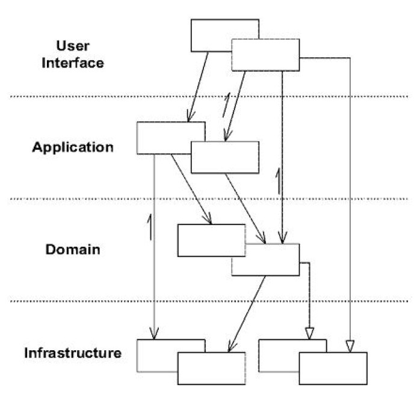
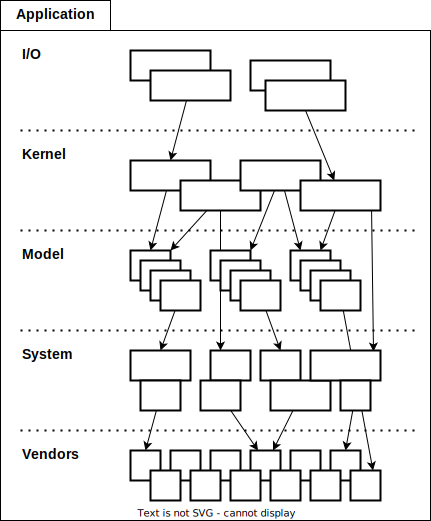
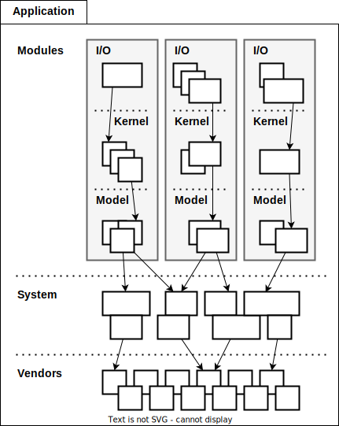

= TS-12: Application Architecture
:toc: macro
:toc-title: Contents

This technical standard sets out principles and best practices for designing and implementing standalone software applications.

An application is defined here as a software component that runs in a single process and is designed to perform a specific function or set of functions. An application may be a standalone executable, a library, or a service or microservice within a larger distributed system.

In client-server systems such as web applications, the client-side application may specialize in only the user interface, while the server-side application specializes in data processing, business logic, and state persistence. GUI applications tend to require a specialist architecture, which is outside of the scope of this technical standard.

toc::[]

== Horizontal layers

Applications SHOULD adopt a layered architecture. A layered architecture involves organizing code into conceptual layers that each represent distinct concerns.

An excellent model for separating concerns into layers is provided by Eric Evans in his "blue book" on https://www.domainlanguage.com/ddd/blue-book/[domain-driven design]. The following image is taken from that book.

Evans proposed four conceptual layers in an application's architecture:

* The *user interface* or *presentation* layer is responsible for showing information to the user and interpreting the user's commands. (The "user" may be any external actor, such as a person or another computer process.)

* The *application* layer coordinates the application's jobs. This is a thin layer that does not contain any business rules, but which exists to coordinate tasks requested by users via the UI layer above, delegating much of the work to services or objects in the domain layer below. The application layer may manage state related to the progress of operations, but should not manage state related to domain objects.

* The *domain* or *model* layer is where the business domain or problem space is modeled as a series of interconnected objects, using object-oriented programming constructs. The domain layer captures business rules and logic, and manages the state of business entities (though the technical details of persisting domain state is delegated to the infrastructure layer).

* The *infrastructure* layer provides general technical capabilities that support the higher layers. For example, abstractions of the database access layer, file system access, and network communication protocol should be implemented in the infrastructure later. Interfaces for messaging services, logging tools and monitoring services, and other external systems, are other candidates for inclusion in an application's infrastructure layer.

A key constraint of domain-oriented architecture is that software components within each conceptual layer depend only on components in the layers below it. The objective of this constraint is to isolate the domain model from the rest of the application code.

[quote, Eric Evans, Domain-Driven Design: Tackling Complexity in the Heart of Software (2003)]
____
Separating the domain layer from the infrastructure and user interface… allows a much cleaner design of each layer. Isolated layers are much less expensive to maintain, because they tend to evolve at different rates and respond to different needs.
____

The following is an iteration on the domain-based layered architecture. It uses the same four conceptual layers, but with different names and one additional layer.

The RECOMMENDED layers are:

- *I/O*: Conceptually equivalent to the UI layer in domain-based architecture, the I/O layer is responsible for capturing input from users (or other clients) and returning responses. It parses incoming message formats, validates input data, and maps user requests to commands, event handlers, or services in the application kernel. The I/O layer may handle communication with the outside world via multiple different protocols and technologies. For example, an API application may support I/O via a combination of HTTP, WebSockets, gRPC, and message queues. An application may also support a command line interface (CLI) alongside a graphical user interface (GUI), for example.

- *Kernel*: The kernel is the core of the application. All input to, and all output from, the application should pass through this layer. The application kernel controls everything that happens in the application, just as an operating system kernel controls everything that happens in the operating system. Conceptually, the kernel is equivalent to the application layer in domain-driven design. The kernel should be relatively thin, acting mostly as a mediator between the I/O handlers (in the layer above) and the domain services and objects (in the model layer below). The application kernel should not hold state related to the domain model, but it may hold application state that reflects the progress of tasks being undertaken for users.

- *Model*: This layer encapsulates a model of the application's business domain or problem space. (Models, in this context, are not _data models_, such as those generated by ORM tools. They are _domain models_, which are a representation of the business domain and its rules.) The model is coded using object-oriented constructs, which encapsulate business rules and represent entities, events, and other concepts from the domain. This layer is also responsible for managing business state (though responsibility for persisting this state is delegated to external systems such as databases).

- *System*: The system layer is analogous to the infrastructure layer in domain-driven designs. It provides abstractions to the runtime platform of the application, and to components in the wider system in which the application operates – things like databases, message queues, other services running on the same local network, external services running on remote networks, and so on.

- *Vendors*: This is an optional layer, which is not present in domain-based layered architecture. This layer provides facades to third-party libraries that are installed locally in development environments and bundled with the production instances of the application. (Such dependencies are commonly managed using a package management system, but this is not a requirement.) This allows application code, in the layers above, to import the facades rather than the underlying dependencies, making it easier to replace vendor components with alternative implementations.

Conceptually, the first four layers map directly to the four layers in the domain-driven design architecture.

- UI, presentation → I/O
- Application → Kernel
- Domain, model → Model
- Infrastructure → System

The fifth layer – called "vendors" – is a pragmatic addition that recognizes the reality that modern software applications tend to have a very high dependence on application frameworks and third-party libraries. The inclusion of this layer is intended to encourage application developers to reduce coupling on vendor-specific APIs and libraries by abstracting them behind facades, the interfaces to which are defined by the application and captured in this layer.

As in domain-driven design, components within each layer SHOULD depend only on components in the layers below them.

In domain-driven design, there is a constraint that components in each later communicate only with components in layers below them (layers may be "skipped"). This technical standard adds an extra design constraint on the application kernel layer, which is that _all input to, and all output from, an application should pass through its kernel_. Thus, communication to and from the I/O layer MUST NOT skip the kernel.

image::./_/layered-architecture-monolith-with-mandatory-kernel.svg[]

This constraint is intended to make the application kernel the central point of control for the whole application.

One of the advantages of this design is that the layers are stacked in alphabetical order. If the layers are represented as directories in the codebase, they will be listed in alphabetical order in most filesystems by default, and so the visual representation of the layers in the code will match their conceptual positioning in the architecture.

----
.
├── IO
│   └── ...
├── Kernel
│   └── ...
├── Model
│   └── ...
├── System
│   └── ...
└── Vendors
    └── ...
----

== Vertical slices

An extension of this layered architecture adds vertical slices through the top three layers, organizing the main application-specific code into modules. For example, an application may be composed of three modules: users, products, and orders. Each module has its own I/O and application kernel, and also its own model that represents a subdomain of the overall domain.

Critically, the modules SHOULD NOT be allowed to call each other directly. Instead, modules should communicate indirectly (and ideally asynchronously, using messages or events) via a channel provided by the system layer.

This design constraint reduces coupling between modules, making it easier to maintain and scale an application. For example, it becomes possible to incrementally extract modules into separate services, so decomposing a system from a modular monolith to a distributed service-oriented design.

The filesystem for a modular monolith's source code might look like the below scheme. The filesystem reflects the conceptual architecture, with each module encapsulated in its own directory, and the horizontal layers of the architecture represented as subdirectories within each module. The global layers – system and vendors – are represented as top-level directories, extracted from the modules.

----
.
├── Modules
│   ├── <ModuleA>
│   │     ├── IO
│   │     │   └── ...
│   │     ├── Kernel
│   │     │   └── ...
│   │     └── Model
│   │         └── ...
│   ├── <ModuleB>
│   │     ├── ...
│   │     └── ...
├── System
│   └── ...
└── Vendors
    └── ...
----

== External dependencies

Applications MUST *fail gracefully* when external dependencies are unavailable or performing unacceptably (eg. high latency).

// TODO: Expand on the concept of *graceful degradation*.
