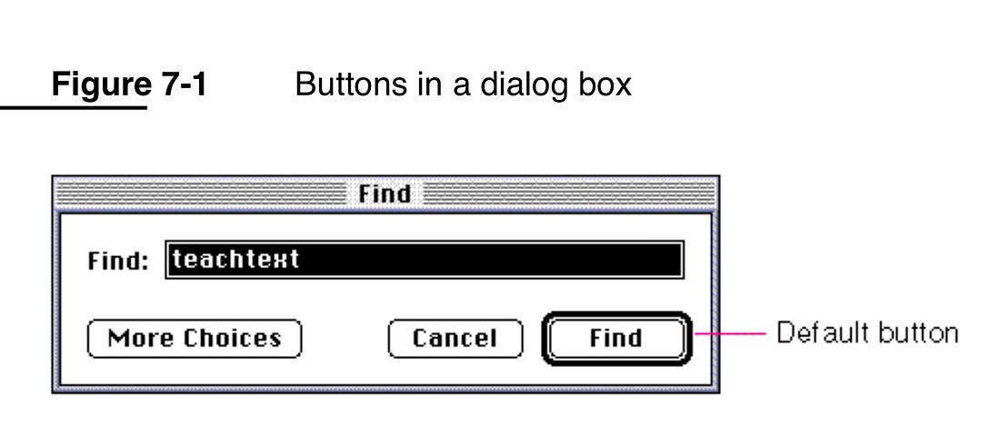

= TS-14: User Interfaces
:toc: macro
:toc-title: Contents

This technical standard covers general best practices for designing and implementing any kind of human-computer interface. These guidelines are not specific to any particular technology or application platform, but cover general principles that apply to all user interfaces.

User interfaces are defined here as any visual or auditory interface that allows either a human user or a programmatic client to interact with a system. User interfaces include graphical user interfaces (GUIs), terminal user interfaces (TUIs) or command line interfaces (CLIs), and application programming interfaces (APIs).

toc::[]

== Design principles

=== Keep it tidy

Avoid making a user interface cluttered and janky. Keep it tidy, by following these guidelines:

* Eliminate unnecessary animations and transitions that do not add value to the user experience.

* Use whitespace to separate elements and make the interface easier to read and navigate.

* Use a consistent layout and design language throughout the application.

* Use a grid system to align elements and create a sense of order.

* Use a limited color palette to create a cohesive visual identity.

* Use a single font face, varying only the weight of the text (to add emphasis) and size of the text (to represent hierarchy).

* Use icons to convey meaning and reduce the need for text.

* Use a responsive design to ensure the interface looks good on all devices and screen sizes.

Be careful with colors: they are great as accents, useful for grabbing attention and placing emphasis. But using too many colors gets visually noisy. And colors are not accessible to everyone, so any information represented by color MUST still be accessible without the color.

=== Embrace affordances

An *affordance* is a quality of an object that suggests how it can be used.

In his book _The Design of Everyday Things_, Dan Norman provides an example of a door handle. Doors you _pull_ should have a nice handle for gripping and yanking, while doors you _push_ should have a flat plate or bar that you can push against. The handle _affords_ pulling, while the bar _affords_ pushing.

Doors that violate these conventions are infuriating to use, because they operate against people's intuition.

Unlike doors, which are bound by physics, software design affordances are more cultural. We invent them, and sometimes they stick. The more that a person is exposed to different software, the more they will develop awareness about how different types of human-computer interface controls work.

Traditionally, user interfaces have been designed to mimic physical objects. This allows users to apply their knowledge of the physical world to the digital world. A button in a GUI has an affordance that suggests it can be clicked, because it looks like a physical button in the real world. A text input field has an affordance that suggests it can be typed into, because it looks like a box on a paper form.

But sometimes we need to invent new affordances that don't exist in the physical world. For example, the "pull to refresh" gesture on a mobile device is a relatively new affordance that has been invented for the digital world, and it has been widely adopted because the design proved to be intuitive.

Other long-established software UI affordances include: clickable text is underlined; dialog boxes have a default button that is visually emphasized and is always in the same position; and radio buttons are circular and we can select exactly one in a group, while checkboxes are square and are individually selectable.

