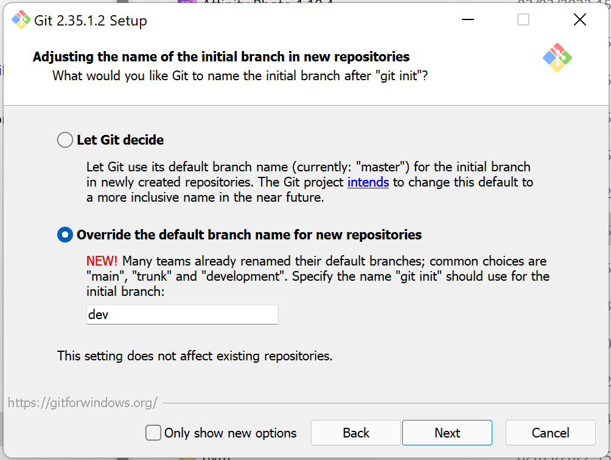
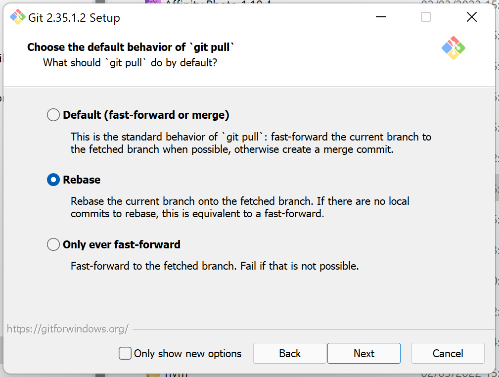

= TS-20: Source Control
:toc: macro
:toc-title: Contents

The following technical standards cover the use of source code management (SCM), also known as source control or version control systems.

https://git-scm.com/[Git] is the _de facto_ industry standard for source control, and is strongly RECOMMENDED for use in software projects. However, similar decentralized source control systems such as https://www.mercurial-scm.org/[Mercurial] and https://fossil-scm.org/[Fossil] MAY be used instead.

Source control SHOULD be integrated with issue tracking. Using a combination of the two systems makes it much easier to manage and track changes in source code and configuration. All-in-one development operations services like https://github.com/[GitHub], https://about.gitlab.com/[GitLab], https://azure.microsoft.com/en-us/products/devops/[Azure DevOps], and https://www.atlassian.com/[Atlassian]'s software suite, provide deep integrations between source control and issue tracking, and are RECOMMENDED for this reason. Alternatively, https://fossil-scm.org/[Fossil] integrates bug tracking directly in its source control system. See also *link:./019-issue-tracking.adoc[TS-19: Issue Tracking]*.

Source control is also the cornerstone of continuous integration and continuous delivery practices. Neither are really possible without a well-designed process for using source control. See also *link:./021-github-actions.adoc[TS-21: GitHub Actions]*.

toc::[]

== Objectives

Git is unopinionated about how it is used. There are many different ways to organize repositories, manage branches, handle merges, and log revisions. The conventions set out in this technical standard are designed with the following objectives in mind.

* *Parallel development*: One of the primary use cases for source control is to support multiple parallel work streams on the same codebase. A source control workflow should not overly restrict this, but parallel development should not be entirely unbounded, either. A well-designed source control workflow should introduce _just enough_ friction to avoid some of the risks associated with parallel development, which manifest as merge conflicts and other issues.

* *Low risk*: Merge conflicts can be time-consuming to resolve and they increase the likelihood of bugs and regressions reaching production. The distributed nature of Git, which gives us the flexibility to check out and make different changes to the same files at the same time, places the responsibility on development teams to reduce the occurrence of merge conflicts. This requires careful planning of the sequencing of changes and their subsequent integration.

* *Keep it simple*: Software projects are more likely to be successful if the development process is robust. Robustness is achieved by keeping the process simple and intuitive. Good workflows can be repeated over and over again with low likelihood of error. Individual contributors should need to know only a small subset of `git` CLI commands, and they should need to perform only a small number of manual operations.

* *Continuous integration*: All work-in-progress SHOULD be integrated into shared mainline tracks at regular intervals. Ideally, the work-in-progress of each contributor should be integrated at least once a day. Side branches SHOULD be short-lived – with limited exceptions, such as for proof-of-concept development. Continuous integration has many, many benefits, one of which is to further reduce the occurrence of time-sucking merge conflicts between parallel development streams.

* *Continuous delivery*: There MUST be a single mainline track, the last commit of which MUST always reference a revision of stable, production-grade artifacts. Furthermore, we MUST be able to deploy to production (or production-like environments such as staging servers or canary channels) the latest stable revision _immediately_, without even needing to wait for builds to complete or tests to pass. This constraint is intended to allow production services to be rebuilt quickly. For example, in response to an incident, a recent production release can be rolled back immediately.

* *Continuous deployment*: Continuous deployment is not appropriate for every software product, but where it is appropriate we SHOULD deploy changes to all production and production-like environments frequently. We certainly MUST avoid big bang releases, by shipping lots of smaller, incremental changes instead. Our target is for the last commit of the stable branch to never be more than one week older than any other commit in any other branch. Shipping to production regularly reduces the risk of regressions and makes it easier to identify the root cause of any issues that do arise in production (because the last release's diff is always small).

* *Fast rollback*: Continuous deployment also requires fast reproducibility of _prior_ versions. If an incident occurs in production after a release, we MUST be able to rollback to the last known good version _as quickly as possible_, and with a high degree of confidence that the rollback will be successful. This depends on prior versions maintaining stability indefinitely. A goal of this source control workflow is to be able to recreate a system, or any prior version of it, at any time.

* *Fast feedback*: Besides continuous integration, delivery, and deployment, our source control workflow MUST support a high degree of automation throughout the development and operations processes. In particular, we are interested in using tools to get fast feedback on the quality of our evolving software. It is RECOMMENDED that both static and runtime tests be run on every commit, rather than be delayed until the point of integration (this recommendation may be relaxed to reduce excessive devops infrastructure costs).

* *Quality gates*: Out-of-the-box, the source control workflow should be lightweight and as frictionless as possible. But the trick to optimizing development velocity is to build in _just enough_ friction to maintain stability in the evolving software. After all, development velocity will decrease if the quality of the system is allowed to incrementally deteriorate. So, the source control workflow should be designed to maximize the utility of Git's lightweight branching and merging operations, but also to allow quality gates to be added as appropriate for each project.

* *Automation*: We SHOULD also automate repetitive tasks such as the generation of release notes and changelogs, the bumping of version numbers, the management of secrets and feature flags, and so on. Automation is a key enabler of our ability to deliver software quickly and safely. It reduces the risk of human error and allows us to focus on the problem-solving and creative aspects of our work, and less on the mundane bits. Automation increases productivity and makes development work more enjoyable and rewarding. To optimize the potential for automation, sufficient metadata needs to be embedded in commit objects, branches, and tags.

* *Provenance*: Each and every feature in our production services MUST be traceable back to a business requirement, bug report, or incident that initiated them. We can achieve this by tightly integrating our source control and issue tracking systems. If we enforce a strict two-way binding between tasks in the issue tracker and changes in the source control system, we'll be able to query Git for all changes related to a particular issue, and we'll be able to query the issue tracking system for all requirements related to particular changes logged in a repository's revision history.

* *Clean history*: The output from `git log` MUST produce a clean and meaningful changelog, with clearly signposted release points. This log output MUST be both human-readable and machine-parsable, so changelogs can be auto-generated in other presentation formats such as web pages. This is necessary to be able to meet the previous objectives of automation and provenance. More than this, a repository's log is an important artifact in its own right. Clean code and clean logs complement each other. A clean codebase helps to understand the current state of a system, but this is only a snapshot in time. A clean commit log gives us visibility of a project's history, and so helps us to understand the context in which the current code exists.

* *Scalable*: Finally, it should be possible to scale the Git workflow from small hobby-scale projects to large-scale enterprise applications. The idea is that a baseline workflow – which requires just a single branch – can be incrementally extended with opt-in features and procedures, as necessary to scale a project.

Not all of these objectives can be met exclusively through design of the source control workflow. For example, achieving continuous integration and delivery, and especially continuous deployment, has implications for the design of the software system under source control itself. It will certainly be necessary to integrate into the software some kind of feature flag system, for example.

[IMPORTANT]
======
Some aspects of these objectives are covered by *link:./031-releasing.adoc[TS-31: Releasing]*.
======

== Git configuration

It is RECOMMENDED that developers set the following configurations in their user-level `.gitconfig` file.

=== core.autocrlf

[source,ini]
----
[core]
  autocrlf = false
----

This setting tells Git to not transform line endings to CRLF when files are checked out from a remote repository to a local repository on a Windows system. Doing such a transformation is unnecessary since all modern code editors can be configured to support Unix line endings (LF), and this can also be enforced at the repository-level using tools like https://editorconfig.org/[EditorConfig].

=== core.eol

[source,ini]
----
[core]
  eol = lf
----

This setting tells Git to normalize line endings to the Unix standard (LF) on all files that Git auto-detects as being text-based. This is equivalent to adding the following rule to `.gitattributes`.

[source,ini]
----
* text=auto eol=lf
----

=== init.defaultBranch

The branching-and-merging workflow described in this technical standards recommends the use of a default branch named `dev`. The following setting will tell Git to use this name for the default branch (replacing `main` or `master`) whenever you create a new empty repository.

[source,ini]
----
[init]
  defaultBranch = dev
----

This option can also be set via the installation wizard for Git for Windows.

=== pull.rebase

On `git pull` operations, it is RECOMMENDED to always rebase the current branch on top of the upstream branch after fetching. This helps to maintain a clean, linear history, and to ensure a consistent chronology of commits between local branches and the remote branches they track.

But this is not Git's default behavior, so to perform a pull operation with the rebase strategy you need to run the following command:

----
$ git pull --rebase
----

You can make the `--rebase` flag the default behavior by adding the following setting to your `.gitconfig.

[source,ini]
----
[pull]
  rebase = true
----

Now every `git pull` operation that you run locally will use the rebase strategy, as though you had explicitly provided the `--rebase` option.

[NOTE]
======
Even with this option set in your `.gitconfig`, this may not change the default behavior of Git GUIs such as those built into code editors like IntelliJ or VS Code. You may need to adjust equivalent settings for your preferred Git GUIs, too.
======

An alternative strategy is to use the `--ff-only` flag on `git pull` operations.

[source]
----
$ git pull --ff-only
----

This ensures that the current branch will be fast-forwarded to the upstream branch, and there will not be an explicit merge commit. If there is divergent work in the upstream branch, the pull operation will fail, forcing you to do an initial `git rebase` on the upstream branch.

The end result is the same: a linear commit history is maintained, and the chronology remains consistent between local branches and the remote branches they track.

If you prefer the fast-forward-only strategy, you can make the `--ff-only` option the default for all `git pull` operations by using the following configuration.

[source,ini]
----
[pull]
  ff = only
----

This option overrides both the `pull.rebase` and `merge.ff` options.

Both strategies – rebase or fast-forward-only – can be enabled via the installation wizard for Git for Windows.

== Repositories

All changes in code and configuration MUST be captured in a source code management system, either Git or another SCM with an equivalent featureset.

For each repository, there MUST be a single centralized repository that is the "source of truth" for the codebase. This is known as the *reference repository*.

All contributors MUST implement changes in copies of the reference repository, which are downloaded ("cloned" in Git-speak) to the developers' local development environments. These clones are called *local repositories* or *downstream repositories*.

For public open source software projects, some contributors will have read-only access to the reference repository. In this case, the contributors must fork the reference repository to another upstream repository under their control, before cloning their fork to their local development environment. This is known as the *fork-and-clone workflow*.

The reference repository and its forks are collectively known as *upstream repositories*. The upstream repositories are hosted on central servers, usually managed by a hosting service provider such as GitHub or GitLab.

A local repository provides an isolated development environment, allowing multiple contributors to work in parallel. Changes MUST be committed first to local repositories before they are synchronized with ("pushed" to) the upstream reference repositories they track.

The goal of these constraints is for developers to be able to check out a repository, run some scripts contained within the repository, and have a complete working application running in their local development environments (also configured in the repository) without any external dependencies. In addition, developers SHOULD be able to checkout any version from a repository's history and be able to build, run, test, and deploy that version – again, without relying on any external dependencies that are not configured at the same version point in the same repository.

Thus, if an application calls other external systems or services, the application MUST operate without error when those external systems are unavailable. It SHOULD also be possible to run the application in "development mode" or "test mode", which mocks all those external dependencies.

These constraints ensure the reproducibility of builds and deployments, supporting continuous deployment and automated rollback practices. For the ultimate guarantees over stability of prior releases, development teams may consider checking in all local dependencies to source control, instead of relying on a checked-in package manager configuration to be able to recreate such dependencies in the future.

=== Repository scope

The boundaries of code repositories SHOULD NOT be arbitrary. A repository is not merely a container for a random assortment of code. Rather, the boundaries of repositories SHOULD reflect the boundaries of software components – applications, services, or libraries – with a repository encapsulating all relevant application code and configuration, tests, requirements specifications, developer documentation, user documentation, infrastructure configuration, and any other artifacts that are relevant to that software component.

Within multi-team organizations, the boundaries of repositories should also map to the boundaries of responsibilities of the teams. Each repository SHOULD be owned by exactly one team. One team MAY own more than one repository, but all repositories under a single team's ownership SHOULD be closely related (eg. fall under the same bounded context).

=== Mono-repos

The scope of a repository SHOULD correspond to the boundaries of a discrete software component. That component MAY be part of a wider system of components, perhaps a distributed system, but each repository MUST encapsulate _one or more_ components that can be started and run together, without requiring other components or dependencies from other repositories to be presents.

Mono-repos MAY be used to encapsulate two or more related software components, and mono-repos are REQUIRED where two or more software components are so tightly coupled that they must always coexist – ie. the components must be used together, or built, run, tested, and deployed together.

Keeping coupled components together means that changes to one component can be easily made in the context of the other components that depend on it. This can help to manage breaking changes, and it maintains the principle of each repository encapsulating everything that is needed to build, run, test, and deploy a complete working application (even if that application is actually one subsystem of a larger distributed application).

[IMPORTANT]
======
The boundaries of repositories SHOULD represent the boundaries of highly coupled components.
======

All components in a mono-repo SHOULD have the same version numbers. Within a repository, everything at the same revision SHOULD work together. This means that the repository itself can be tagged with release points (rather than these being captured in code and configuration within the repository's contents, which would be necessary for multi-versioned components).

Using repository-level versioning signifies the tight coupling between the software components maintained in the repository, and thus the need to version them together. A mono-repo may encapsulate the code and configuration for two distinct microservices that are each deployed to different infrastructure. If updates to those microservices must be coordinated due to some kind of tight coupling between their APIs, or perhaps due to shared persistence layers, then those microservices SHOULD be maintained together in the same repository.

[IMPORTANT]
======
Use version control to control the versions that go together.
======

It SHOULD be possible to run a complete deployment operation from a single repository, without requiring coordination with other deployments from other repositories.

Within a mono-repo, different components MAY be written in different programming languages and/or target different runtime environments. For this reason, the code and configuration of a mono-repo MAY follow differing coding standards.

=== Repository naming conventions

A clear repository naming convention, standardized across teams and projects, makes it easier to:

* Quickly identify the purpose and content of a repository.
* Search and retrieve repositories more effectively.
* Share workflow automations (eg. CI/CD workflows could dynamically adjust based on a repository's name).

It is RECOMMENDED to:

* Prefix repositories with the name of the team, subdomain, or project. Betters still, use internal codenames to identify projects, which will not change even if a team name changes, or if the public-facing branding for a product changes. So, for the website for a product branded "Initech", the repository name might be `zeus__website`.

* For repositories that are not scoped to any particular project or team, but which are relevant to the whole organization, use a generic prefix like `common__`, `shared__`, or `global__`, or the name of the organization itself.

* It is best practice to encapsulate all code and configuration for a discrete software component in a single repository, but where this is not possible consider using a consistent repository name but add a suffix to identify the specific contents of each repository, eg. `--app`, `--db`, `--config`, `--docs`, `--infra`, `--lib`, `--test`, `--tool`, etc.

* If different versions of a software component are maintained in different repositories, append the repository with a version identifier, eg `-legacy`, `-next`.

* Use lower case ASCII letters only. Avoid including numbers and do not include special characters. Use hyphens to separate words in the repository name.

* Do not reference the technology stack in the repository name. The technology stack is an implementation detail that can change over time, and it does not really help to identify the contents of the repository. Repository names SHOULD be short but descriptive of the _domain_ of the software component, rather than descriptive of the solution or technology. If you want to identify the technology stack, hosted repository services like GitHub and GitLab also you to add descriptions, metadata, labels, tags, or topics to repositories.

Examples:

----
global__requests-for-comments
global__technical-standards
zeus__http-api-v1
zeus__http-api-next
zeus__website--app
zeus__website--db
zeus__website--infra
----

=== Preparing new repositories

To prepare new Git repositories, it is RECOMMENDED to first create the upstream reference repository. This is done via GitHub, or what Git hosting service is being used.

Clone the reference repository on your local machine. It is RECOMMENDED to use the SSH protocol. Example:

----
$ git clone git@github.com:/[team]/[repo].git
----

Alternatively, create an empty directory on your computer, change to that empty directory, and then initialize a blank Git repository within it.

----
$ mkdir [repo]
$ cd [repo]
$ git init
----

When you directly `git clone` an upstream repository, Git assigns the identifier "origin" to reference the upstream repository from where the clone originated. This doesn't happen when you initialize a Git repository from scratch, so you must run the following command to manually configure the location of the upstream repository.

----
$ git remote add origin git@github.com:/[team]/[repo].git
----

Before you can set up the branches, you need to have some files to commit. Start by creating the project's README.

----
$ touch README.adoc
$ echo "= [Project Title] >> README.adoc"
----

Now stage it.

----
$ git add README.adoc
----

And commit it.

----
$ git commit -m "chore: add readme"
----

When you committed the README file, Git would have created a default branch called `master` or `main`, depending on how Git is configured on your computer. As per the branching conventions documented below, it is RECOMMENDED to use a default branch called `dev`. You can use the `git branch -m` command to force the current branch to be moved (ie. rename it).

----
$ git branch -m dev
----

Push the new branch up to the reference repository. Use the `--set-upstream` option, or its alias `-a`, to have the local `dev` branch track a branch of the same name in the remote repository.

----
$ git push --set-upstream|-u origin dev
----

Because this will have been the first time that anything is committed to the upstream repository, the `dev` branch should have been automatically set as the default branch. You can check this by inspecting the settings for the repository in GitHub or GitLab.

These are the minimum requirements to prepare a new repository. Optionally, additional branches can be created, as required. See the *Branches* section, below, for details on OPTIONAL branches. For example, to create the `stable` branch:

----
$ git branch stable
$ git checkout stable
----

These two commands can be combined into one:

----
$ git checkout -b stable
----

Alternatively, from Git v2.23 you can use the new `git switch` command with the `--create` or `-c` option:

----
$ git switch --create|-c stable
----

Remember to push all the branches you create into the reference repository, setting up tracking with your local repository.

----
$ git push --set-upstream|-u origin stable
----

Use the `git branch` command to view all the local branches you have created. Use the `--all` or `-a` option to view remote-tracked branches, too.

----
$ git branch --all|-a
----

=== Branch protection rules

Finally, it is RECOMMENDED to configure *branch protection rules* in the reference repository. These are access controls that restrict what changes can be introduced to certain branches in the reference repository. The purpose is to prevent accidental misuse, such as pushing directly to the `stable` branch or changing the history of the `dev` branch.

Branch protection rules are not a feature of Git itself, but rather are a wrapping feature provided by code repository hosting services. Branch protection rules are set up in the repository settings on GitHub or GitLab.

== Branching

=== Branching metaphors

Branching-and-merging strategies are often explained using railway metaphors. *Mainline tracks* are perpetual branches that represent the main line of development. Most branching-and-merging strategies will have a single mainline track, which is invariably named `main`, `master`, `develop`, or `trunk`. More advanced branching-and-merging strategies may have multiple mainline tracks running alongside each other, with *merge points* along their routes where they are synchronized.

Continuing the railway metaphor, *side branches* are short-lived branches that branch off the mainline tracks before merging back in later along the line. Side branches are used for parallel development of features, fixes, and other development tasks.

=== Branching strategies

Git supports many branching-and-merging strategies, including but not limited to:

* *Trunk-base development*: This is where all changes are committed directly to a single perpetual mainline track. This branch is commonly called `main`, `master`, `trunk`, or `develop`, but this technical standard RECOMMENDS naming it `dev`.

* *Feature branching*: This is where feature development, bug fixes, and other development tasks, are undertaken in short-lived side branches. Once the changes are stable or complete, they are integrated into the mainline track and the feature branch is deleted.

* *Environment branching*: This is where each deployment environment has its own branch, eg. `test`, `staging, `prod`. Automated deployment pipelines are triggered by merging changes into these branches. Thus, deployments are controlled via the source control system.

* *Release branching*: This is where versioned releases are "cut" from a stable branch, and the release is prepared in its own branch before being tagged with a release number.

Each of these branching strategies solves different problems, and they can be combined in various ways to serve all the use cases of a project. This technical standard described a Git workflow that combines all of the above branching strategies.

=== Branch types

This technical standard describes a Git workflow that is based on the following branch types:

|===
|Branch type |Naming convention |Role |Ownership |Lifespan |Mutable |Stable |Requirement level

|Development
|`([version]/)dev`
|Task and epic integrations, trivial changes
|Team
|Permanent
|No
|No
|REQUIRED

|Issue
|`([version]/)issue/[issue_id]-[description]`
|Feature development, bug fixes, refactoring, maintenance
|Individuals and pairs
|Temporary
|Yes
|No
|OPTIONAL

|Testing
|`([version]/)test`
|Quality assurance
|Team
|Permanent
|No
|No
|RECOMMENDED

|Production
|`([version]/)prod`
|Production-grade builds
|Team
|Permanent
|No
|Yes
|RECOMMENDED
|===

Different branch types represent different stages of the software development and release life cycle. Thus, the inclusion of commits in the history of branches indicates the life cycle stage those changes have reached. Changes are implemented in issue branches, merged into a shared dev branch, before flowing through various branches that represent different quality gates in the testing process, and finally to the stable branch, from where versions of the software are packaged for distribution to production systems.

== Committing

The following is a guide to the best practices for committing changes to a source code repository.

=== Atomic commits

The foundation of a clean and searchable commit log is the concept of atomic commits.

An atomic commit is a small, self-contained, incremental change to a codebase that does not break the build or tests. A commit does not necessarily represent a "complete" feature or fix, but it does represent a small logical step toward that goal.

When implementing changes, developers SHOULD commit one small change at a time. Large changes SHOULD be split into smaller partial, but stable, changes. Lots of small, discrete changes are  preferred to a smaller number of large, monolithic changes.

Each commit SHOULD be a coherent change. A commit SHOULD be scoped to a single concern and technology layer. For example, database schema changes SHOULD be committed separately from application code changes, and back-end service changes SHOULD be committed separately from front-end GUI changes, and so on.

In each commit, tests SHOULD pass and the build SHOULD succeed. This means avoiding commits that "fix the tests that were broken in the previous commit".

[quote, The Git project]
____
Each commit is a minimal coherent idea.
____

Small, incremental changes are easier to understand when it comes to code review. They also make it easier to track the history of the codebase and to identify the purpose of each change.

Atomic commits also allow for continuous integration. Small, incremental, stable changes can be regularly integrated into shared mainline tracks, reducing the risk of integration issues and conflicts. Where issue branches are used to implement changes, it is RECOMMENDED that those branches be merged or squashed into the development branch at least once per day.

Atomic commits also make it easier to revert specific changes – and "fixing forward" by adding revert commits is often the quickest way to resolve production issues.

The smaller individual commits, the better. If your commits are too granular, you can always squash them together. But it is harder to do the opposite, to split a large commit into smaller ones.

=== Commit types

To help enforce the constraint of atomic commits, each commit MUST be scoped to exactly one of the following six concerns. It is expected that all changes to code and configuration can be categorized into one of these types:

1. Chore
2. Dev
3. Feature
4. Fix
5. Refactor
6. Release

It is expected that all changes to code and configuration can be categorized into one of these types.

Most changes to the code and configuration of the software can be categorized as *dev* work. This covers changes to code and configuration that represent an increment toward changes to the features – operations and behaviors – of the software, but which themselves do not impact user-facing functionality or performance.

A *feature* is a change in user-facing functional or non-functional behaviors of the software. This category of change includes the toggling on (or off) of new external features of the system, such as the enabling of a new API endpoint, as well as the enabling of operational qualities such as improved security and resilience. This category also covers the deprecation and removal of existing features.

A *fix* is any change that resolves some sort of bug, error, regression, or incident – not necessarily a user-facing issue.

A *chore* is any general housekeeping, maintenance, and other work required in the upkeep of the system under source control. This covers a broad range of tasks including, but not limited to, the updating of dependencies, tooling configuration, improvements to tests, and edits to READMEs and other documentation.

A *refactor* is a change that improves the format, design, or structure of code, without changing the system's operations or behavior. Refactoring of code covers automated tests and build scripts, as well as the source code and configuration for the production system.

Finally, a *release* captures a set of changes made in preparation of a new software release.

[NOTE]
======
Semantically, some of these commit types map to issue types defined in *link:./019-issue-tracking.adoc[TS-19: Issue Tracking]*. For example, a *refactor* commit is conceptually similar to an *improvement* issue, and a *fix* commit may be associated with a *bug* ticket or *incident*.

But there is not necessarily a one-to-one mapping between commits and issues. For example, resolution of a bug may require multiple discrete fixes, and a feature may require a sequence of incremental dev changes, and perhaps some refactoring too, before the feature can be enabled for users.
======

Separating discrete development concerns into separate commit objects has many advantages. For example, separating refactoring work from the implementation of functional changes will make it easier to understand the functional changes and to review them. For the same reason, two distinct refactorings SHOULD be committed separately, too.

This also makes it easier to revert specific changes, which may be the quickest way to resolve a bug that has slipped through to production.

=== Commit message formats

To meet the above objectives, there must be very precise rules for the formatting of commit messages.

The following commit message convention is loosely based on https://www.conventionalcommits.org/[Conventional Commits], which in turn is based on the conventions of the https://github.com/angular/angular/blob/22b96b9/CONTRIBUTING.md#-commit-message-guidelines[Angular project].

Each commit message consists of a header, a body and a footer. Each block is separated by a single empty line.

[source,txt]
----
<header>

<body>

<footer>
----

The header has a special format that includes a type and a description, separated by a semi-colon and exactly one space.

[source,txt]
----
<type>: <description>

<body>

<footer>
----

The header is the only REQUIRED component. The type MUST be one of the following words, which map to the different types of commit concerns listed above:

1. `chore`
2. `dev`
3. `feature`
4. `fix`
5. `refactor`
6. `release`

Using predefined type identifiers as a prefix for commit messages makes it easy to filter out unimportant changes using `git bisect`.

The description SHOULD be a short message that summarizes the change. This SHOULD be written all lower case, with not period (full stop) or other punctuation to terminate the statement. Generally, there SHOULD NOT be multiple distinct changes in a commit, but if there are, the descriptions of each change SHOULD be separated by a comma.

The objective is for the command `git log --oneline` to produce an easily readable, high-level view of the sequence of incremental changes. Example:

----
a1b2c3d chore: initial commit, add readme
d4e5f6g dev: add openapi specification
h7i8j9k fix: invalid yaml formatting
b9r5y8t refactor: move openapi spec to resources directory
c2c6a8w chore: proofread readme content
b3e5r7t feature: enable route to openapi spec
e3r5t7y release: v0.0.0
----

The `<type> : ` prefix in the header line MAY be omitted in repositories that contain only documentation, specifications, or other non-executable, non-software artifacts. These repositories MAY adopt their own commit messages conventions. Example:

----
d8f7781 ts-20: add commit message formats
47bf11e ts-20: add breaking changes identification
cf16b24 ts-32: update notes on breaking changes convention
----

==== Breaking changes

Breaking changes must be clearly signposted in the commit header. To do this, the capitalized word "BREAKING" is appended to the end of the header, demarcated from the description by a spaced hyphen. Example:

----
22a36c7 dev: remove password field from login action on user repository - BREAKING
----

The concept of a breaking change differs from Conventional Commits and other commit message conventions. In the example of the `dev` commit above, the breaking change is made to the _internal_ API of the system, in this case to a method signature. Internal breaking changes could also involve changes to data structures, event schemas, and facades to dependencies and third-party systems.

The purpose of marking internal breaking changes is to draw the attention of other developers who may be working on parallel changes that will break once their changes are integrated with yours, due to shared code and configuration.

Breaking changes to public APIs SHOULD be labelled in the same way. Example:

----
24b3g40 feature: remove password field from login endpoint - BREAKING
----

However, the purpose of the BREAKING label on commit messages is not to capture breaking changes in public APIs. Changelogs, release notes, interface definitions, and other such artifacts are more appropriate places to capture this information.

[IMPORTANT]
======
Commit messages capture information that is of interest to other developers of the system, not to its users, clients, customers, or other external stakeholders.
======

The relaxed definition of a breaking change means that this commit message convention cannot be used for the purpose of auto-generating version numbers for new releases, where the version numbering system expresses breaking changes. See *link:./032-versioning.adoc[TS-32: Versioning]*. Other artifacts – changelogs, release notes, interface definitions, package manifests – SHOULD be used to capture major version changes in a system's public API. This requires manual intervention, rather than reliance on automation, which is more appropriate for such as important decision.

== References

* https://nvie.com/posts/a-successful-git-branching-model/[GitFlow] — This branching-and-merging strategy, documented by Vincent Driessen in 2010, was designed for the intermittent release of versioned software. It is characterized by its two main branches, `master` and `develop`. GitFlow was not intended for continuously delivered, singly versioned software like web apps, though it has been widely adopted for that purpose.

* https://about.gitlab.com/2014/09/29/gitlab-flow/[GitLab Flow] — This workflow offers a better template for the source code management of continuously delivered web-based software systems.

* https://scottchacon.com/2011/08/31/github-flow.html[GitHub Flow] — This is a minimalist workflow, ideal for personal and small open source projects. It uses a single `main` branch, and feature branches are created for each new feature or bug fix.

* https://www.atlassian.com/blog/archives/simple-git-workflow-is-simple[Atlassian's Simple Git Workflow] — This uses feature branches but with the rebase strategy suggested for integrations back to the main branch. It also adds environment branches and release branches.

* https://www.atlassian.com/git/tutorials/comparing-workflows[Comparing Git workflows] — This article, also from Atlassian, provides a good overview of the main design choices to be made when establishing a Git workflow.

* https://git.kernel.org/pub/scm/git/git.git/tree/Documentation/SubmittingPatches?id=HEAD[Submitting Patches] — Guidelines for writing commit messages for patches to the Git project itself, and which forms the basis for most commit conventions, including Conventional Commits and these technical standards.

* https://www.conventionalcommits.org/[Conventional Commits] — A widely-adopted standard for writing commit messages, from which changelogs can be auto-generated.

* https://github.com/angular/angular/blob/22b96b9/CONTRIBUTING.md#-commit-message-guidelines[Angular's commit message guidelines] — The basis for Conventional Commits.
