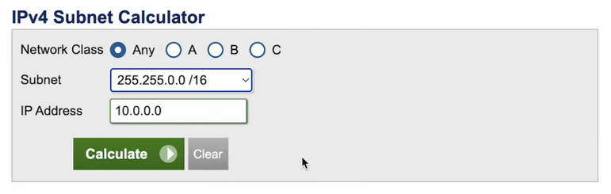

= TS-39: Amazon Web Services (AWS)

== Identity and access management

=== Root users

Every AWS account has a root user, which is the most privileged user in the account. It has full access to all AWS services and resources.

For security reasons, it is strongly RECOMMENDED that you do not use the root user for everyday tasks. Instead, create an administrative IAM user with more limited permissions.

After signing up for a new AWS account, you SHOULD:

* Set a very, _very_ strong password for the root user.
* Enable multi-factor authentication for the root user.
* Make sure that the root user does not have any access keys, so restricting the root user's access to the web console only.
* Create an IAM user with the `AdministratorAccess` policy, and use it to administer your AWS account instead.
* Enable IAM user and role access to billing information (this can be done via Billing and Cost Management), so that costs can also be managed by a non-root user.
* Set alerts for root user activity.

There will still be a few use cases where you will still need to access AWS using the root user. For example, when you want to close your AWS account, or when you want to change the primary email address associated with the account. Otherwise, all AWS activities SHOULD be undertaken by non-root users.

=== IAM and IAM Identity Center

The AWS *Identity and Access Management (IAM)* service is used to create *users*, *groups*, *roles*, and *policies*. The policies define which resources users can create and manage in the AWS account.

The *IAM Identity Center*, which was previously known as the *AWS Single Sign-On (SSO)* service, serves a broader purpose. It is used for managing identities of all kinds, including but not limited to IAM users.

It is now RECOMMENDED to use the IAM Identity Center to manage all user identities from a single, centralized service.

IAM Identity Center can have multiple identity sources. An identity source could be IAM itself, or it could be an external identity provider such as Active Directory (self-managed), Azure AD (hosted), Okta, or any other standard identity provider (IdP) that uses SAML 2.0.

IAM Identity Center also supports built-in SSO integrations with many widely-used business applications, from Adobe Creative Cloud to Zoom, so you can enable user access to lots of SaaS services very easily.

IAM Identity Center also integrates with *AWS Organizations*, which provides an alternative interface through which to manage IAM users.

=== AWS Organizations

AWS Organizations is a service that can be used to manage multiple AWS accounts under a single organization.

To use AWS Organizations, you create a *Management Account*, which will be at the root of the account hierarchy you create. You can then create additional AWS accounts, or invite existing accounts, into your organization. For example, you might choose to create a "Production" and a "Development". Additional accounts will be managed by the Management Account.

It is a common pattern in large organizations to have multiple AWS accounts managed under one AWS Organization. It allows the control of resources and permissions to be delegated to divisions or products within the organization.

It is RECOMMENDED to use AWS Organizations for this reason. Even if your organization starts with a simple structure and a s ingle product, building out your infrastructure under a sub-account allows you to more easily scale to new products and services in the future while keeping your cloud infrastructure clearly delimited by product.

=== IAM policies

IAM policies MAY be attached directly to IAM users, but it is RECOMMENDED to attach them to groups instead.

This makes it much easier to manage permissions across multiple users. This is especially important for large organizations with lots of users, where it becomes impractical to manage the permissions of users individually.

== Resource naming conventions

Names for cloud resources MUST follow a consistent format. A standardized naming convention will help to identify, sort, and filter resources, and to quickly identify characteristics such as the resource owner, deployment environment and location, and associated workload or software component. A good resource naming policy is also a prerequisite for establishing cloud governance and automated policy evaluation and enforcement (which requires resource names to be machine-parsable).

Resource naming conventions SHOULD, ideally, be agnostic to the cloud provider, such that the same naming convention can be used across multiple cloud providers. However, there are some differences in limits such as name length and letter case between cloud providers, so some variation in the naming convention may be necessary.

In designing your cloud resource naming convention, identify the key pieces of information that you want to capture in resource names. You will probably want to capture a subset of the following components in your resource names:

|===
|Component |Description

|Account
|Name of the AWS account that owns the resource.

|Business unit
|The department within the organization that owns the workload associated with the resource, if different departments launch resources in the same AWS account.

|Workload, application, or project
|To identify how the resource fits into the overall architecture of your software system.

|Environment
|The stage of the development life cycle that the resource supports.

|Resource type
|The type of cloud resource or asset.

|Region, location, or scope
|The region into which the resource is deployed, or the parent resource that the resource is associated with (eg. VPC), if not a global resource.

|Instance
|The instance count for replicable resources, eg. `001`, `002`, etc.

|Suffix
|A random hash to ensure uniqueness.
|===

The general rule of thumb is to keep resource names short and simple. Use only letters and numbers for individual components. For delimiters, it is RECOMMENDED to use single hyphens (`-`), for the widest compatibility with all cloud providers and their resource types. This means hyphens SHOULD NOT be included in the resource name components themselves. For example, use `webserver` instead of `web-server`.

Think carefully about the order in which the components appear in a resource name. The components that are most helpful in identifying the _purpose_ of a resource SHOULD be listed first.

Different information will be relevant to different types of resources, so your naming convention should be sufficiently flexible to accommodate all of its use cases. So think carefully also about which components you want to make compulsory, and which components you want to make optional.

The optimum naming convention will depend on the specific needs of your organization, and the types of resources you are using. But the following is a good starting point. This is based on https://stepan.wtf/cloud-naming-convention/[Stepan Stipl's cloud naming convention], which was developed for GCP, and https://blog.avangards.io/my-quest-to-finding-the-perfect-aws-resource-naming-scheme[Anthony Wat's] variation for AWS.

----
<prefix>-<project>-<description>-<env>-<resource>-<location>-<suffix>
----

|===
|Component |Description |Required |Constraints

|`<account>`
|Account identifier
|Yes for multi-account AWS organizations
|[a-z][a-z0-9]{3}

|`<project>`
|Project, component, or module
|Yes
|[a-z0-9]{4-10}

|`<description>`
|Optional description
|No
|[a-z0-9]{1,20}

|`<env>`
|Deployment environment
|Yes (except for domain names and other resources that are not environment-specific)
|[a-z]{3,4} from enum

|`<resource>`
|Resource type
|Yes
|[a-z]{3,4} from enum, or CSP-specific name

|`<location>`
|Region
|No
|Matches CSP region name

|`<suffix>`
|Instance count or random hash
|No
|[0-9]{3}|[a-z0-9]{7}
|===

For the `<account>` component, it is RECOMMENDED to use a short identifier for the AWS account that owns the resource. This is especially important in multi-account AWS organizations, where it is necessary to identify which account a resource belongs to. This component MAY be dropped for singular AWS accounts; alternatively, this component MAY be used to identify the business unit or department that owns the resource. It is RECOMMENDED to use a common set of abbreviations such as `fin`, `mktg`, `prd`, `it`, and `corp` for this purpose. This will help to find a good balance between resource names being descriptive but also concise enough to be easily readable.

The `<project>` component MUST be included but it may refer to different things in different contexts. In a large-scale software system, this component may be used to reference components or subdomains within the same project. Alternatively, this component may be used to identify a workload, application, team, or general usage.

The `<description>` component SHOULD be included where it is necessary to distinguish between resources of the same type but which serve different purposes, for example "frontend" versus "backend" compute resources.

For the `<env>` components, a common set of abbreviations such as `prod`, `dev`, `qa`, `stage`, and `test` SHOULD be used to refer to different deployment environments.

The `<resource>` component identifies the resource type. It is RECOMMENDED this be taken from a custom enum that references generic resource types from all major cloud service providers, eg. `vpc`, `vm`, `cntr` (container), `rdb` (relational database), `bkt` (bucket), etc. Alternatively, this MAY be specific to the cloud provider, in which case it is RECOMMENDED to match the naming convention of the cloud provider itself. For AWS, take the third component of the ARN, eg. `ec2`, `rds`, `s3`, `lambda`, `iam`, etc.

The `<location>` component SHOULD be included where there's a possibility to replicas of a resource could be launched into different locations. Region names SHOULD match the naming convention of the cloud service provider, minus any hyphens (so `us-east-1` becomes `useast1`. This MAY be combined with an AZ suffix, `a` to `f`, eg. `useast1a`, `useast1b`m etc. For global resources such as S3 buckets, an abbreviation such as "gbl" or "g" MAY be used, or the component MAY be dropped from the name altogether.

The `<suffix>` component is OPTIONAL and may be used either for an instance count for replicable resources (`001`, `002`, etc.) or a random hash where there is a requirement for uniqueness (eg. `h7g30ij`), or both (`h7g30ij-001`, `h7g30ij-002`, etc.). For global resources such as S3 bucket names, a common practice is to use your AWS account ID for the resource suffix, to increase the chances of making a globally-unique name.

=== Special cases

Although the above naming convention can be applied to most types of cloud resources, there will inevitably be some exceptions. Some resources have specific naming conventions. For example, AWS IAM resources are generally named using the `PascalCase` convention, while AWS S3 bucket names must be _globally_ unique. You might also want different naming conventions for things like DNS resources.

For Terraform, there is a https://registry.terraform.io/modules/cloudposse/label/null/latest[module] that can be used to define a consistent naming convention for generated resources and tags, and there's https://github.com/Azure/terraform-azurerm-naming[another] that's specific to Azure.

.See also
****
* https://learn.microsoft.com/en-us/azure/cloud-adoption-framework/ready/azure-best-practices/resource-naming[Microsoft Cloud Adoption Framework: Define your naming convention]
****

== Resource tagging strategy

Along with a resource naming convention, a good tagging strategy also helps to improve the governance and management of your AWS resources.

// TODO...

== Virtual Private Clouds (VPCs)

=== CIDR blocks and subnet masks

Choose a VPC CIDR block from the private IP address ranges defined in RFC 1918. These are the ranges that are reserved for private networks, and are not routable on the public internet. These ranges are:

* `10.0.0.0/8` (`10.0.0.0` - `10.255.255.255`)
* `172.16.0.0/12` (`172.16.0.0` - `172.31.255.255`)
* `192.168.0.0/16` (`192.168.0.0` - `192.168.255.255`)

The allowed size for a VPC CIDR block is between `/16` (65,536 IP addresses) and `/28` (16 IP addresses).

Avoid `172.17.0.0/16`. Some AWS services, like Cloud9 and SageMaker AI, use this CIDR range. Avoiding using it for your VPCs will prevent IP address conflicts with these services.

Subnets should have smaller CIDR ranges than their VPC, and there MUST NOT by any overlaps in the IP ranges of subnets in the same VPC, to avoid routing issues. A common practice is to use a `/16` CIDR block for the VPC (eg. `10.0.0.0/16`) and then create subnets within that VPC using smaller CIDR blocks like `/24` or `/28`. For example, you could create a `/24` subnet (eg. `10.0.1.0/24`) for your web servers, a `/24` subnet (eg. `10.0.2.0/24`) for your application servers, and a `/24` subnet (eg. `10.0.3.0/24`) for your database servers. That gives each subnet about 200 possible private IP addresses — more than enough for most use cases.

You can use the subnet allocation feature in a multi-VPC architecture to standardize on the IP sizing of subnets, for example, mandating a smaller CIDR size, like a `/27`, for public subnets, and a larger CIDR size, like a `/24` for private subnets.

Plan your IP addressing scheme to ensure that your VPC and subnets are well-organized and scalable. You should plan for each subnet to have enough addresses not only for the resources you intend to deploy immediately, but also to allow room for future growth.

Keep in mind that the first four IP addresses and the last IP address in each subnet CIDR block are not available for your use and cannot be assigned to a resource, such as an EC2 instance.

[TIP]
======
Use the https://www.calculator.net/ip-subnet-calculator.html[IP Subnet Calculator] to help you calculate the CIDR ranges for your VPC and subnets.

======
