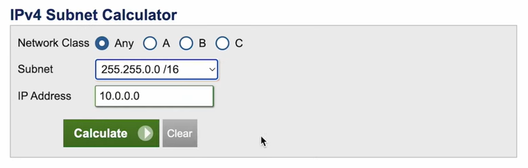

= TS-43: Amazon Web Services (AWS)
:toc: macro
:toc-title: Contents

This technical standard covers best practices for using AWS services.

toc::[]

== Identity and access management

=== Root users

Every AWS account has a root user, which is the most privileged user in the account. It has full access to all AWS services and resources.

For security reasons, it is strongly RECOMMENDED that you do not use the root user for everyday tasks. Instead, it is best practice to create an administrative IAM user with the `AdministratorAccess` policy, and use it to administer your AWS account instead. Then, for the root user account, set a very strong password and enable multi-factor authentication. You SHOULD also make sure that the root user does not have any access keys, so restricting the root user's access to the web console only. You SHOULD also set alerts for root user activity.

You can enable IAM user and role access to billing information (this can be done via Billing and Cost Management), so that costs can also be managed by a non-root user.

There will remain a few use cases where you will need to access AWS using the root user. For example, when you want to close your AWS account, or when you want to change the primary email address associated with the account. Otherwise, all AWS activities SHOULD be undertaken by non-root users.

=== IAM and IAM Identity Center

The AWS *Identity and Access Management (IAM)* service is used to create *users*, *groups*, *roles*, and *policies*. The policies define which resources users can create and manage in the AWS account.

The *IAM Identity Center*, which was previously known as the *AWS Single Sign-On (SSO)* service, serves a broader purpose. It is used for managing identities of all kinds, including but not limited to IAM users. AWS now recommends the use of the IAM Identity Center to manage all user identities from a single, centralized service.

IAM Identity Center can have multiple identity sources. An identity source could be IAM itself, or it could be an external identity provider such as Active Directory (self-managed), Azure AD (hosted), Okta, or any other standard identity provider (IdP) that uses SAML 2.0.

IAM Identity Center also supports built-in SSO integrations with many widely-used business applications, from Adobe Creative Cloud to Zoom, so you can very easily enable user access to lots of SaaS services.

IAM Identity Center also integrates with *AWS Organizations*, which provides an alternative interface through which to manage IAM users.

=== AWS Organizations

It is a common pattern in large organizations to have multiple AWS accounts managed under one organization. This allows the control of resources and permissions to be delegated to separate business units or product divisions within the organization. *AWS Organizations* is the AWS service that you use to manage multiple AWS accounts under a single organization.

To use AWS Organizations, you create a *Management Account*, which will be at the root of the AWS account hierarchy you create. You can then create additional AWS accounts, or invite existing accounts, into your organization.Additional accounts will be managed by the root Management Account.

Even if your organization has a simple structure or just a single product, building out your infrastructure for that product under a sub-account will allow you to more easily scale to new products and services in the future, while keeping your cloud infrastructure clearly delimited by product.

=== IAM policies

IAM policies MAY be attached directly to IAM users, but it is RECOMMENDED to attach them to groups instead.

This makes it much easier to manage permissions across multiple users. This is especially important for large organizations with lots of users, where it becomes impractical to manage the permissions of users individually.

== Resource naming conventions

Names for cloud resources MUST follow a consistent format. A standardized naming convention will help you to identify, sort, and filter resources, and to quickly identify characteristics of resources such as the owner, deployment environment and location, and the associated software component or workload. This has numerous benefits, but perhaps it has the greatest utility in facilitating rapid responses to production incidents.

A good resource naming policy is also a prerequisite for establishing cloud governance. And to automate policy enforcement – and, indeed, to ease the automation of all kinds of processes – resource names need to be machine-parsable. This means having a consistent, global naming schema shared by all resources across all your AWS accounts.

The first step in designing a resource naming convention is to identify the key pieces of information that you want to embed directly in the names of resources. Categories of information that you will want to consider include:

* *Account*: Name of the AWS account that owns the resource.

* *Business unit*: The department within the organization that owns the workload associated with the resource.

* *Workload, application, or project*: To identify how the resource fits into the overall architecture of your software system.

* *Environment*: The stage of the development life cycle that the resource supports.

* *Resource type*: The type of cloud resource or asset.

* *Region, location, or scope*: The region into which the resource is deployed, or the parent resource that the resource is associated with (eg. VPC), if not a global resource.

* *Instance*: The instance count for replicable resources, eg. `001`, `002`, etc.

Resource information that is not embedded directly in resource names can instead be captured in metadata attached to resources (in AWS, tags are used for this purpose). The information you embed in your resource name schema should be limited to the information that is most useful for identifying the _purpose_ of a resource – why it exists.

Think carefully, too, about the order in which the components appear in a resource name. The components that are most helpful in identifying the purpose of a resource SHOULD be listed first.

Different information will be relevant to different types of resources, so your naming convention should be sufficiently flexible to accommodate all of its use cases. Consider which components you want to make compulsory, and which you want to make optional.

Ideally, resource naming conventions SHOULD be agnostic to the cloud provider. This allows for the same naming convention to be used across all cloud providers, and also on-premises resources. This is especially useful for organizations that are using multiple cloud providers, or that are planning to migrate workloads between cloud providers, or from on-premises to the cloud, in the future. However, there are some differences in the constraints that different cloud providers place on the names of different categories of resources. For this reason, some variation in your resource naming convention may be necessary.

The general rule of thumb is to keep resource names short and simple. Use only lower case ASCII letters and numbers for individual components. Avoid special characters, including underscores and periods (full stops). For delimiters, it is RECOMMENDED to use single hyphens (`-`), for the widest compatibility with all cloud providers and their resource types. This means hyphens SHOULD NOT be included in the resource name components themselves. For example, use `webserver` instead of `web-server`.

=== Resource name template

The optimum naming convention will depend on the specific needs of your organization, and the types of resources you are using. But the following is a good starting point. This is based on https://stepan.wtf/cloud-naming-convention/[Stepan Stipl's cloud naming convention], which was developed for GCP, and https://blog.avangards.io/my-quest-to-finding-the-perfect-aws-resource-naming-scheme[Anthony Wat's] variation for AWS.

----
{organization}-{account}-{project}-{description}-{environment}-{resource}-{location}-{instance}-{suffix}
----

|===
|Component |Description |Required |Constraints

|`{organization}`
|Global identifier for the parent organization
|Yes
|[a-z][a-z0-9]{2,7}

|`{account}`
|Account identifier
|Yes for multi-account AWS organizations
|[a-z][a-z0-9]{3,4}

|`{project}`
|Project name
|Yes, unless the account identifier serves this purpose
|[a-z0-9]{4-12}

|`{module}`
|Software module or component name
|No
|[a-z0-9]{1,20}

|`{environment}`
|Deployment environment
|Yes, except for domain names and other resources that are not environment-specific
|[a-z]{3,4} from enum

|`{resource}`
|Resource type
|Yes
|[a-z]{3,4} from enum, or CSP-specific name

|`{location}`
|Region
|No
|Matches CSP region name + AZ

|`{instance}`
|Instance count
|No
|[0-9]{3}

|`{suffix}`
|Random hash or account ID
|No
|[a-z0-9]{7} or account ID
|===

It is RECOMMENDED to use a consistent `{organization}` identifier across all resources across all your AWS accounts. It is RECOMMENDED that this be a registered business name, or at least a unique trademark. The intention is to try to make resource names as unique as possible, not only to your organization but to the whole of AWS (even though there is no way to verify this for non-global resources). Otherwise resource names may come into conflict if environments merge in the future. This scenario might seem unlikely, but businesses are acquired and merged all the time. And there are other scenarios, such as clients working with a managed service provider, game publisher, or venture capital business, where accounts from different real-world organizations become part of a shared AWS Organization. By using a registered business name as a namespace (prefix) for all AWS resources associated with that business entity, these issues can be mitigated.

The `{account}` component is REQUIRED for multi-account AWS organizations, where it is necessary to distinguish resources owned by different accounts. This component MAY be dropped for singular AWS accounts; alternatively, this component MAY be used to identify the business unit or product department that owns the resources, where multiple departments/products share the same AWS account but have distinct resources. It is RECOMMENDED to use a common set of short abbreviations such as `fin`, `mktg`, `prd`, `it`, and `corp`. The objective is to find a good balance between resource names being descriptive but also concise enough to be easily readable.

The `{project}` component MUST be included, unless the `{account}` component fulfils an equivalent purpose (ie. if you have one account per project). A "project" will mean different things in different contexts. In a large-scale software system, this component may be used to reference components or subdomains within the same software system. Alternatively, this component may be used to identify a workload, application, team, or general usage.

The `{module}` component is optional. It is used to identify a specific module or component within a software system, eg. "backend" and "frontend" components, or specific service names. Use this component of the resource name where it would not otherwise be possible to distinguish between two or more resources based on the other components alone. For storage systems, this part might be used to define the data type(s) stored, or the name of the database engine (eg. "mariadb", "oracle"). It's flexible.

For the `{environment}` component, a common set of abbreviations such as `prod`, `dev`, `qa`, `stage`, and `test` SHOULD be used to refer to different deployment environments. This will not be applicable to all resource types, and it can be dropped where other components such as `{account}` identify the target environment.

The `{resource}` component identifies the resource type. It is RECOMMENDED this be taken from a custom enum that references generic resource types from all major cloud service providers, eg. `vpc`, `vm` (eg. EC2 instance), `fn` (serverless function, eg. Lambda), `cntr` (container), `rdb` (relational database), `obj` (object storage or bucket), etc. Alternatively, this MAY be specific to the cloud provider, in which case it is RECOMMENDED to match the naming convention of the cloud provider itself. For AWS, take the third component of the ARN, eg. `ec2`, `rds`, `s3`, `lambda`, `iam`, etc.

The `{location}` component SHOULD be included where there's a possibility that replicas of a resource could be launched into different locations. For AWS, regions and availability zones (AZs) will typically be used to identify the location. Region names SHOULD match the naming convention of the cloud service provider, minus any hyphens – so `us-east-1` becomes `useast1`. This MAY be combined with an AZ suffix, `a` to `f`, eg. `useast1a`, `useast1b`, etc. For global resources such as S3 buckets, an abbreviation such as "gbl" or "g" MAY be used, or the component MAY be dropped from the name altogether.

The `{instance}` component SHOULD be used to identify replicated resources, eg. `001`, `002`, etc.

Finally, the `{suffix}` component should be a random hash where there is a requirement for uniqueness (eg. `h7g30ij`). For global resources such as S3 bucket names, a common practice is to use your AWS account ID for the resource suffix, to increase the chances of making a globally-unique name.

=== Resource-specific subsets

You might want to define a subset of this global naming schema for each type of AWS resource that you use. For example, your naming schema for EC2 instances may be:

----
{organization}-{project}-{module}-{environment}-vm-{location}-{instance}
----

Example:

----
hackscorp-arundel-publicapi-prod-vm-useast1a-001
----

And for S3 buckets you might use this subset of the global naming schema:

----
{organization}-{project}-{module}-{environment}-obj-{accountid}
----

Example:

----
hackscorp-arundel-logos-prod-obj-123456789012
----

Don't be afraid to deviate from your global naming schema for specific resource types, where you need additional information to identify the purpose and ownership of a resource. There will inevitably be some exceptions where your default resource naming convention isn't adequately expressive. Things like DNS resources, CloudFormation changesets, and subnets may not neatly fit into the normal resource pattern. In addition, some AWS resource types have unique naming conventions. For example, AWS IAM resources are generally named using the `PascalCase` convention; you may decide to stay consistent with AWS's IAM naming convention, or define your own.

Just be aware that the greater the variability in your resource naming, the greater the difficulty you will have in implementing automation and governance processes.

.AWS resource-specific naming conventions – examples
|===
|Resource type |Schema |Examples

|VPCs
|`{org}-{project}-{module}-{env}-vpc-{region}`
|`hackscorp-arundel-authapi-prod-vpc-useast1

|Subnets
|`{org}-{project}-{module}-{env}-vpc-{region}-subnet-{scope}`
|`hackscorp-arundel-authapi-prod-vpc-useast1-subnet-public`

|Route tables
|`{org}-{project}-{module}-{env}-vpc-{region}-rt-{scope}`
|`hackscorp-arundel-authapi-prod-vpc-useast1-rt-public`

|NAT gateways
|`{org}-{project}-{module}-{env}-vpc-{region}-nat
|`hackscorp-arundel-authapi-prod-vpc-useast1-nat`

|NACLs
|`{org}-{project}-{module}-{env}-vpc-{region}-nacl
|`hackscorp-arundel-authapi-prod-vpc-useast1-nacl`

|EC2 instances
|`{org}-{project}-{module}-{env}-vm-{location}-{instance}`
|`hackscorp-arundel-authapi-prod-vm-useast1-001`

|Load balancers
|`{org}-{project}-{module}-{env}-lb-{location}-{instance}`
|`hackscorp-arundel-authapi-prod-lb-useast1-001`

|Auto-scaling groups
|`{org}-{project}-{module}-{env}-asg-{location}`
|`hackscorp-arundel-authapi-prod-asg-useast1`

|Security Groups
|`{org}-{project}-sg-{description}`
|`hackscorp-arundel-sg-public`

|IAM roles used for EC2 instances
|`{org}-{project}-{module}-{env}-role`
|`hackscorp-arundel-authapi-prod-role`

|RDS instances
|`{org}-{project}-{module}-{env}-rdb-{engine}-{master|slave}-{location}-{instance}`
|`hackscorp-arundel-authapi-prod-rdb-mysql-slave-useast1-001`

|Lambda functions
|`{org}-{project}-{module}-{env}-fn`
|`hackscorp-arundel-reportbatch-prod-fn`

|S3 buckets
|`{org}-{project}-{module}-{environment}-obj-{accountid}`
|`hackscorp-arundel-logos-prod-obj-123456789012`
|===

=== Tools

For Terraform, there is a https://registry.terraform.io/modules/cloudposse/label/null/latest[module] that can be used to define a consistent naming convention for generated resources and tags, and there's https://github.com/Azure/terraform-azurerm-naming[another] that's specific to Azure.

=== See also

* https://learn.microsoft.com/en-us/azure/cloud-adoption-framework/ready/azure-best-practices/resource-naming[Microsoft Cloud Adoption Framework: Define your naming convention]

* https://learn.microsoft.com/en-us/azure/azure-resource-manager/management/resource-name-rules[Naming rules and restrictions for Azure resources]

== Resource tagging strategy

Along with a resource naming convention, a good tagging strategy will help to improve the governance and management of your AWS resources.

Tags should be used for adding supplementary metadata that does not need to be immediately apparent from the resource name itself. In AWS, a tag is a simple label consisting of a customer-defined key and an optional value.

Tags enable AWS customers to categorize resources by any criteria of their choosing. Resources can then be searched and filtered based on these criteria. In the AWS Management Console, you can use Resource Groups to customize the view of your resources based on the tags you have assigned to them. This allows you to, for example, create views of resources (of multiple types) related to specific applications or departments.

Tags are also used for billing purposes, so you can track costs by project, department, or other criteria. You can use the AWS Cost Explorer to analyze your costs and usage based on the tags you have assigned to your resources. For example, you may use tags to associate costs with technical, security, or compliance dimensions.

Tags are also often used to filter resources in infrastructure automation processes. Tags can be used to opt resources into or out from automated tasks, such as backups, patching, or security scans. For example, many AWS customers run automated start/stop scripts that spin down non-production resources outside of business hours. Tags can be used to identify which resources should be included in these scripts.

Finally, IAM policies support tag-based conditions, enabling customers to constrain permissions based on specific tags and their values. For example, IAM user or role permissions can include conditions to limit access to specific environments (eg. dev, test, prod) based on the tags assigned to the VPCs for those environments.

Tags are used for a variety of other purposes, too. An organization's tagging strategy should be designed to meet the specific use cases of the organization. Nevertheless, the following offers some guidance and best practices for all kinds of tagging strategies.

The key thing is consistency. If a portion of your AWS resources are missing tags for cost allocation, for example, then your cost analysis process will be more time consuming and/or less accurate. Likewise, if you are missing tags to identify resources that contain sensitive data, you may need to assume that all resources contain sensitive data – increasing your costs.

So the _management_ of your tags – how you enforce and audit the use of your tags – is, arguably, more important than how you _define_ your tags.

=== Identify your stakeholders

IAM users who may need to be able to manage tags include:

* Cloud administrators
* Software developers / application owners
* Infosec
* Finance
* Legal and compliance

Each of these groups of stakeholders will be responsible for the management of different groups of tags, determined by the use cases of those tags.

=== Identify your use cases

The use cases for tags will vary from organization to organization. It is best to have different groups of tags for different use cases. Some common use cases include:

* *Resource management*: How do you want to group your resources in the AWS Management Console? For example, do you wish to view all resources associated with a project, application, team, department, etc.?

* *Cost allocation*: How do you want to break down your costs in analysis?

* *Compliance*: For example, do you need to be able to identify resources that store personally-identifiable information or other sensitive data?

* *Automation*: Do you want to use tags to drive automated processes such as patching, backup and restore, monitoring, job scheduling, and disaster recovery?

And so on.

For each use case, owners should be assigned to manage the associated tags. Tag owners have the responsibility to articulate the value proposition of the tags they manage.

If cost allocation will be one of your use cases for tags, be aware that your monthly cost allocation reports will be calculated based on the tags that you had assigned to your resources over the whole month of the reporting period. Cost allocation reports will not be recalculated when cost allocation tags are changed. New cost allocation tags will be applicable only from the point in time they are applied to resources.

For other use cases, tagging decisions are reversible.

=== Identify required and conditionally-required tags

Tags can be required, conditionally-required, or entirely optional.

Conditionally-required tags are only mandatory under certain circumstances. For example, if an application processes sensitive data, you may require a tag to identify the corresponding data classification (eg. personally-identifiable information, protected health information).

When identifying tagging requirements, focus on required and conditionally-required tags. But allow for optional tags, too – as long as they conform to your tag naming and governance policies. Optional tags can empower people to define new tags for unforeseen or bespoke application requirements.

Start with a small set of tags hat are known to be needed, and create tags as new needs emerge. This approach is preferable to specifying an exhaustive list of tags at the outset, which may prove to be impractical to manage.

=== Tag naming convention

Some tags are predefined by AWS or created automatically by various AWS services. AWS-defined tags tend to be named using all lower case ASCII letters, with hyphens separating words, and colon-delimited prefixes to identify the source service. Examples:

* `aws:ec2spot:fleet-request-id`: Identifies the Amazon EC2 Spot Instance request ID that launched the instance.

* `aws:cloudformation:stack-name`: Identifies the AWS CloudFormation stack that created the resource.

* `lambda-console:blueprint`: Identifies "blueprint" as a template for an AWS Lambda function.

* `elasticbeanstalk:environment-name`: Identifies the application that created the resource.

* `aws:servicecatalog:provisionedProductArn`: The provisioned product Amazon Resource Name (ARN).

* `aws:servicecatalog:productArn`: The ARN of the product from which the provisioned product was launched.

AWS-generated tags form a namespace. For example, in an AWS CloudFormation template, you define a set of resources to be deployed together in a stack, where `stack-name` is a descriptive name that you assign to identify it.

It is RECOMMENDED to use a similar naming convention for your custom tags. In particular, it is RECOMMENDED to use a consistent prefix that identifies your business and account. This distinguishes your own tag schema from AWS's built-in tags, and it also reduces the risks associated with merged AWS accounts (as described in the section on resource naming, above).

A simple starter template for a tag naming convention could be something like:

----
{organization}:{department}:{key}
----

This could scale to the following use cases:

|===
|Use case |Tag schema |Description |Example values

|Data classification
|`{organization}:infosec:data-classification`
|Information security-defined set of data classifications.
|`sensitive`,`confidential`,`personal`

|Operations
|`{organization}:ops:environment`
|Implement scheduling of developing and testing environments.
|`development`,`staging`,`qa`,`production`

|Disaster recovery
|`{organization}:dr:rpo`
|Define the recovery point objective (RPO) for a resource.
|`6h`,`24h`

|Cost allocation
|`{organization}:fin:cost-allocation`
|Finance teams implement cost reporting on each team's usage and spend.
|`corporate`,`recruitment`,`support`,`engineering`
|===

[IMPORTANT]
======
In AWS, tags are case-sensitive. So, `costCenter` and `costcenter` are treated as different tag keys. American English SHOULD be used for consistent spelling, too (in this case, "center", not "centre").
======

=== See also

* https://docs.aws.amazon.com/whitepapers/latest/tagging-best-practices/tagging-best-practices.html[Best practices for tagging AWS resources]

== Virtual Private Clouds (VPCs)

=== CIDR blocks and subnet masks

Choose a VPC CIDR block from the private IP address ranges defined in https://datatracker.ietf.org/doc/html/rfc1918[RFC 1918]. These are the ranges that are reserved for private networks, and are not routable on the public internet. These ranges are:

* `10.0.0.0/8` (`10.0.0.0` - `10.255.255.255`)
* `172.16.0.0/12` (`172.16.0.0` - `172.31.255.255`)
* `192.168.0.0/16` (`192.168.0.0` - `192.168.255.255`)

The allowed size for a VPC CIDR block is between `/16` (65,536 IP addresses) and `/28` (16 IP addresses).

Avoid `172.17.0.0/16`. Some AWS services, like Cloud9 and SageMaker AI, use this CIDR range. Avoiding using it for your VPCs will prevent IP address conflicts with these services.

Subnets should have smaller CIDR ranges than their VPC, and there MUST NOT by any overlaps in the IP ranges of subnets in the same VPC, to avoid routing issues. A common practice is to use a `/16` CIDR block for the VPC (eg. `10.0.0.0/16`) and then create subnets within that VPC using smaller CIDR blocks like `/24` or `/28`. For example, you could create a `/24` subnet (eg. `10.0.1.0/24`) for your web servers, a `/24` subnet (eg. `10.0.2.0/24`) for your application servers, and a `/24` subnet (eg. `10.0.3.0/24`) for your database servers. That gives each subnet about 200 possible private IP addresses – more than enough for most use cases.

You can use the subnet allocation feature in a multi-VPC architecture to standardize on the IP sizing of subnets, for example, mandating a smaller CIDR size, like a `/27`, for public subnets, and a larger CIDR size, like a `/24` for private subnets.

Plan your IP addressing scheme to ensure that your VPC and subnets are well-organized and scalable. You should plan for each subnet to have enough addresses not only for the resources you intend to deploy immediately, but also to allow room for future growth.

Keep in mind that the first four IP addresses and the last IP address in each subnet CIDR block are not available for your use and cannot be assigned to a resource, such as an EC2 instance.

[TIP]
======
Use the https://www.calculator.net/ip-subnet-calculator.html[IP Subnet Calculator] to help you calculate the CIDR ranges for your VPC and subnets.

======
