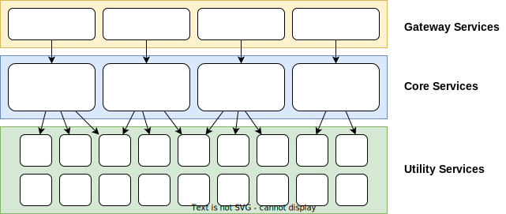

= TS-X Distributed System Design Standards

== Inter-service communication

In general terms, there are three ways to implement inter-service communication
in distributed systems:

* Commands
* Messages
* Events

Command-driven systems utilize direct RPC calls between services. Message-driven
systems similarly see commands being issued from one service to another, but
the communication is done through a central message broker rather than directly
service-to-service, reducing coupling. Event-driven systems are similar to
event-driven ones but even greater decoupling is achieved by making the
communication one-way and the messages more generic.

In practice, in most systems, you will need a mix of all these styles, a mix
of imperative (command-oriented) and declarative (event-oriented) communication.
You will use commands for synchronous, request-response style communication, and
events for asynchronous, fire-and-forget style communication. Use cases for
synchronous commands include trigger two-factor authentication. But the best
practice is to try to design as much inter-service communication as possible
to be event-driven; ie. treat inter-service messages as _events_ rather than
_commands_.

The types of communication also tends to vary between layers of a system.
Communication from the outside world tends to be RPC-style, and the gateway
services will typically make blocking RPC-style requests to the core services.

=== RPC-style communication

=== Message-driven communication

=== Event-driven communication

In event-driven architectures, instead of one piece of code commanding another
to do something, it tells other parts of the system about interesting things
that have happened. Other parts of the code may or may not be listening for
those event notifications, and they can choose to act on them or ignore them.
The event publisher does not expect responses from any other part of the system.

All modern GUI systems are based on event-driven designs. In JavaScript, this is
called an event loop.

In distributed system, event broadcasts are self-contained, atomic messages.
The routing and life cycle management of those event messages is delegated to
dedicated components/infrastructure. ... In a distributed system, it is
necessary to think about how to externalize the code that manages the events
and their routing – the messaging infrastructure. Messaging services publish
the messages, and it manages the subscribers.

The messaging system is also a convenient place to monitor inter-service
communication. It provides a central place from which monitoring can be
plugged in.

The central event messaging system can also take care of a lot of the
infrastructure concerns, eg scaling, clustering, resilience, persistence –
outside of the application code, which is left to specialize in the problem
domain.

Of course, it is possible to use tools like event messaging systems to build
imperative, command-oriented designs. But you will really take advantage of this
kind of infrastructure when you embrace a genuinely distributed design by using
events to build very loosely coupled systems. You will get the inherent
scalability and resilience advantages of truly distributed systems.

Event-driven architecture, done well, can significantly reduce the complexity
of otherwise very complex systems.

Event-driven architecture also gives us more flexibility to grow systems in
unforeseen ways. For example, to add new business services that not new types
of processing on customer orders, then we can just add a new service and have
them listen to the relevant "order" events.

Event-driven architecture _isolates change_ better than other designs. It allows
systems to grow incrementally, and in unplanned ways.

The secret is to _model the problem domain_. The services should model the
*essential complexity* of the domain, while the events infrastructure abstracts
away much of the *accidental* complexity. The sign of a well-designed distributed
system is when all the accidental complexity is moved into the infrastructure,
leaving the service code to only do domain modelling.

The events themselves should model real world processes. Be wary of having too
many technical or tactical events. The events should have business meaning:
orders places, subscriptions cancelled, etc.

The events are the _conversations_ between the components of our system.

.Example: book store
****
Event-driven architectures are *thread efficient*. For example, a book store
could process two or more book orders on the same thread before the first order
is even fulfilled, because we are not waiting (blocking) for a response back
from the warehouse/inventory service. The book store can still make progress
even if the inventory service was down.
****

== Service design

.The stages of service design
****
1. Identify components
2. Identify conversations
3. Identify linking concepts
****

The first two stages fall out quite naturally from a process called *event
storming*.

The linking concepts become unique identifiers that allow us to track entities
through the system, even as those entities are transformed at the boundaries
between different subdomains/contexts. The linking data MUST NOT change
between services; these MUST be consistent globally.

''''

The following are useful *patterns* in service design:

Services can also be treated as *state machines*, so we can easily keep track of
changes in their state, and even replay the timeline of events that have caused
mutations in their state. ... The idea of *services as state machines* is a really
nice pattern. Events produce changes in state in services. That's all. It's very
simple. And all of the complexity that you're interested in is domain-level,
not technical-level, because all of the accidental complexity is externalized
from each service. (eg. we're not interested in weird error scenarios.)

This is also the definition of a https://www.reactivemanifesto.org/[reactive system].
A reactive system is all about mutating domain models in response to events or
messages. It's as simple as that. (This is actually how relational databases
work internally; it's how serious systems do important things.) You can restore
systems from day one, and replay everything in test environments to diagnose
production incidents.

Reactive systems _require_ messaging infrastructure, and this needs to be
reliable and durable. This becomes the main failure point of a reactive system.

* The *order* of the messages MUST be maintained, else services will end up
  in the wrong state. So need to consider if a message gets lost in
  transit.

* Deterministic state: the state of services can only be mutated via messages,
  there can be no backdoors.

* Durable: the messaging infrastructure needs to be available all of the time.

Reactive systems help to decouple services in time and space. The _location_
of services is not event relevant.

Reactive systems !== microservices, but the two concepts are certainly very
close conceptually, and they compliment one another. Reactive system design
works best when each service has its own _unique_ state, and microservices
give us the solution to that (each service has its own unshared DB).

CQRS: Command-Query Responsibility Segregation – where one part of the system
services commands, and other queries the results of those commands.

=== Microservices

Microservices are trickier to implement than many people realize.

Characteristics of microservices:

* Loosely coupled from each other.
* Independently deployable. (This is perhaps the defining characteristic.)
* Autonomous.
* Aligned with a single bounded context.
* Focused on thing. Very small.

The real challenge is not the individual microservices, but rather the design
of the interfaces between them. These need to be well-defined up-front, such
that they are stable, non-breaking... to be independently deployable and loosely
coupled.

We should treat the service interfaces, or rather the conversations between them,
as its own distinct bounded context:

[quote, Eric Evans]
____
The language/protocol of the information that we use to communicate between
services is a separate bounded context.
____

.Bounded contexts
****
Multiple models coexist in big software systems. The bounded context is an area
of code within which one of these models is consistent… eg. a "book" might be
a different thing in the context of a shop versus an order fulfillment system.
The alternative is to have a single data structure that provides everything you
need in every context, but this is hard to achieve in large systems, and where
different teams are responsible (and have autonomy over) different parts of the
system, and perhaps even different parts of the system were built at different
times (between which the model evolved). In this case, it is necessary to
put in translation layers that transform models between contexts.
****

So, in microservice systems, there needs to be a translation in the concepts
they exchange in their communication.

.Premature decomposition
****
DO NOT extract microservices too early, until you know that their APIs are
stable. Until then, keep tightly coupled and/or volatile components together,
preferably in the same code base and sharing the same deployment pipeline.
****

